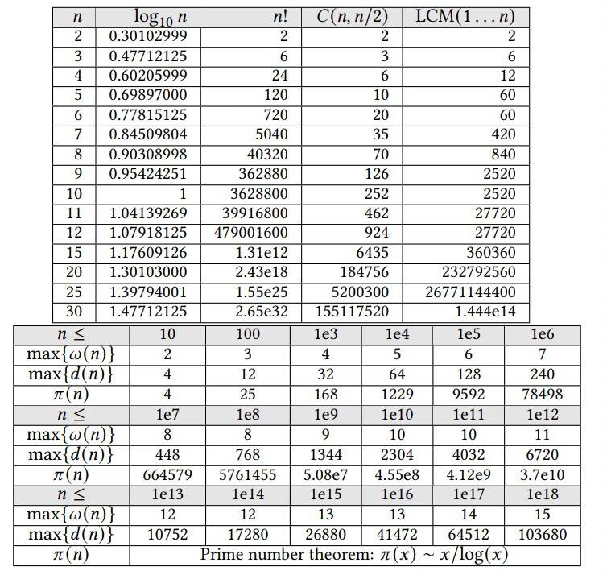

[TOC]

# $Template$

## $杂项$

### $二分$

```C++
//整数域
auto check=[&](int num){};
int l=1,r=1e9,ans=l;
while(l<=r){
    int mid=(l+r)/2;
    if(check(mid)) l=mid+1,ans=mid;
    else r=mid-1;
}
//实数域
const double eps=1e-9;
auto check=[&](double num){};
double l=0,r=1e12;
while((r-l)>max(1.0,l)*eps){
    double mid=(l+r)/2;
    if(check(mid))r=mid;
    else l=mid;
}
```

### $三分$

```C++
int l = 1, r = n;
auto calc = [&] (int x) {};
while(l < r) {
    ll lmid = l + (r - l) / 3;
    ll rmid = r - (r - l) / 3;
    if(calc(lmid) <= calc(rmid))l = lmid + 1;
    else r = rmid - 1;
}
cout << max(calc(l), calc(r)) << endl;
```

### $火车头$

```C++
typedef long long                               ll;
typedef unsigned long long                      ull;
#define int                                     long long
#define itn                                     int
#define endl                                    '\n'
#define Endl                                    endl
#define ednl                                    endl
#define Ednl                                    endl
#define al(a)                                   (a).begin(),(a).end()
#define all(a)                                  (a).begin()+1,(a).end()
#define lowbit(x)                               (x&-x)
#define vi                                      vector<int>
#define pii                                     pair<int,int>
#define pb                                      push_back
#define fs                                      first
#define sc                                      second

constexpr long long maxlonglong = 9223372036854775807;   //9e18
constexpr int maxint = 2147483647;      //2e9
constexpr int INF = 0x7f7f7f7f; //2139062143
constexpr int M = 1e9 + 7;
constexpr int mod =  998244353;
constexpr int p = 0x1F351F35; // good hash number.
const double pi = acos(-1.0);

mt19937_64 rnd(time(0));

ios::sync_with_stdio(false);
ios_base::sync_with_stdio(false);
cin.tie(0);
cout.tie(0);    //关闭同步  如果使用 则不要使用<cstdio>
cout << fixed << setprecision(10);

#pragma GCC optimize(3)
#pragma GCC target("avx")
#pragma GCC optimize("Ofast")
#pragma GCC optimize("inline")
#pragma GCC optimize("-fgcse")
#pragma GCC optimize("-fgcse-lm")
#pragma GCC optimize("-fipa-sra")
#pragma GCC optimize("-ftree-pre")
#pragma GCC optimize("-ftree-vrp")
#pragma GCC optimize("-fpeephole2")
#pragma GCC optimize("-ffast-math")
#pragma GCC optimize("-fsched-spec")
#pragma GCC optimize("unroll-loops")
#pragma GCC optimize("-falign-jumps")
#pragma GCC optimize("-falign-loops")
#pragma GCC optimize("-falign-labels")
#pragma GCC optimize("-fdevirtualize")
#pragma GCC optimize("-fcaller-saves")
#pragma GCC optimize("-fcrossjumping")
#pragma GCC optimize("-fthread-jumps")
#pragma GCC optimize("-funroll-loops")
#pragma GCC optimize("-fwhole-program")
#pragma GCC optimize("-freorder-blocks")
#pragma GCC optimize("-fschedule-insns")
#pragma GCC optimize("inline-functions")
#pragma GCC optimize("-ftree-tail-merge")
#pragma GCC optimize("-fschedule-insns2")
#pragma GCC optimize("-fstrict-aliasing")
#pragma GCC optimize("-fstrict-overflow")
#pragma GCC optimize("-falign-functions")
#pragma GCC optimize("-fcse-skip-blocks")
#pragma GCC optimize("-fcse-follow-jumps")
#pragma GCC optimize("-fsched-interblock")
#pragma GCC optimize("-fpartial-inlining")
#pragma GCC optimize("no-stack-protector")
#pragma GCC optimize("-freorder-functions")
#pragma GCC optimize("-findirect-inlining")
#pragma GCC optimize("-fhoist-adjacent-loads")
#pragma GCC optimize("-frerun-cse-after-loop")
#pragma GCC optimize("inline-small-functions")
#pragma GCC optimize("-finline-small-functions")
#pragma GCC optimize("-ftree-switch-conversion")
#pragma GCC optimize("-foptimize-sibling-calls")
#pragma GCC optimize("-fexpensive-optimizations")
#pragma GCC optimize("-funsafe-loop-optimizations")
#pragma GCC optimize("inline-functions-called-once")
#pragma GCC optimize("-fdelete-null-pointer-checks")
#pragma GCC optimize(2)
```

### $离散化$

```C++
vector<int> tmp(arr);  // tmp 是原数据的一个副本
sort(al(tmp));
tmp.erase(std::unique(al(tmp)), tmp.end());
for (int i=0;i<n;++i)
    arr[i]=lower_bound(al(tmp),arr[i])-tmp.begin();
```

### $约瑟夫问题$

```C++
int josephus(int n,int k) { //n
  int res = 0;
  for(int i=1;i<=n;++i)res=(res+k)%i;
  return res;
}

// klogn   n总人数  m找第m个出列的  报到k出列
int josephus(int n,int m,int k) {
    if(k==1)return (m-1)%n;
    if(m==1)return k-1;
    if(m>=k)return (josephus(n-1,m,k-1)+m)%n;
    int q=min(k-1,n/m),p=josephus(n-q,m,k-q)+q*m-n;
    return p<0?p+n:p+p/(m-1);
}
```

### $快读$

```C++
 inline int read()
{
    int x=0,c; bool f=0;
    for(;(c=getchar())<'0'||c>'9';f|=c=='-');
    for(;c>='0'&&c<='9';c=getchar()) x=(x<<1)+(x<<3)+c-48;
    return f?-x:x;
}

double d[]={0,1e-1,1e-2,1e-3,1e-4,1e-5,1e-6,1e-7,1e-8,1e-9,1e-10};
double read()
{
    int x=0,w=1,now=0,f=0;
    double xs=0;
    char ch=0;
    while(ch<'0'||ch>'9')
    {
        if(ch=='-') w=-1; 
        ch=getchar();
    }
    while(ch>='0'&&ch<='9'||(ch=='.'))
    {
        if(ch=='.')
        {
            f=1;
            ch=getchar();
            continue; 
        } 
        if(f) xs+=(((ch-'0')*d[++now]));
        else x=((x<<3)+(x<<1)+ch-'0');
        ch=getchar();
    }
    xs+=(double)x;
    return xs*w;
}
```

### $高精度$

```C++
struct Bigint {
    // representations and structures
    string a; // to store the digits
    int sign; // sign = -1 for negative numbers, sign = 1 otherwise
    // constructors
    Bigint() {} // default constructor
    Bigint( string b ) { (*this) = b; } // constructor for string
    // some helpful methods
    int size(){return a.size();}
    Bigint inverseSign() { // changes the sign
        sign *= -1;return (*this);
    }
    Bigint normalize( int newSign ) { // removes leading 0, fixes sign
        for(int i=a.size()-1;i>0&&a[i]=='0';i--)a.erase(a.begin() + i);
        sign=(a.size()==1&&a[0]=='0')?1:newSign;
        return (*this);
    }
    // assignment operator
    void operator = ( string b ) { // assigns a string to Bigint
        a = b[0] == '-' ? b.substr(1) : b;
        reverse( a.begin(), a.end() );
        this->normalize( b[0] == '-' ? -1 : 1 );
    }
    // conditional operators
    bool operator < ( const Bigint &b ) const { // less than operator
        if(sign!=b.sign)return sign<b.sign;
        if(a.size()!=b.a.size())
            return sign ==1?a.size()<b.a.size():a.size()>b.a.size();
        for(int i=a.size()-1;i>=0;i--)if(a[i]!=b.a[i])
            return sign==1?a[i]<b.a[i]:a[i]>b.a[i];
        return false;
    }
    bool operator == (const Bigint &b ) const { // operator for equality
        return a==b.a&&sign==b.sign;
    }
    // mathematical operators
    Bigint operator + ( Bigint b ) { // addition operator overloading
        if( sign != b.sign ) return (*this) - b.inverseSign();
        Bigint c;
        for(int i = 0, carry = 0; i<a.size() || i<b.size() || carry; i++ ) {
            carry+=(i<a.size() ? a[i]-48 : 0)+(i<b.a.size() ? b.a[i]-48 : 0);
            c.a += (carry % 10 + 48);
            carry /= 10;
        }
        return c.normalize(sign);
    }
    Bigint operator - ( Bigint b ) { // subtraction operator overloading
        if( sign != b.sign ) return (*this) + b.inverseSign();
        int s = sign; sign = b.sign = 1;
        if( (*this) < b ) return ((b - (*this)).inverseSign()).normalize(-s);
        Bigint c;
        for( int i = 0, borrow = 0; i < a.size(); i++ ) {
            borrow = a[i] - borrow - (i < b.size() ? b.a[i] : 48);
            c.a += borrow >= 0 ? borrow + 48 : borrow + 58;
            borrow = borrow >= 0 ? 0 : 1;
        }
        return c.normalize(s);
    }
    Bigint operator * ( Bigint b ) { // multiplication operator overloading
        Bigint c("0");
        for( int i = 0, k = a[i] - 48; i < a.size(); i++, k = a[i] - 48 ) {
            while(k--) c = c + b; // ith digit is k, so, we add k times
            b.a.insert(b.a.begin(), '0'); // multiplied by 10
        }
        return c.normalize(sign * b.sign);
    }
    Bigint operator / ( Bigint b ) { // division operator overloading
        if( b.size() == 1 && b.a[0] == '0' ) b.a[0] /= ( b.a[0] - 48 );
        Bigint c("0"), d;
        for( int j = 0; j < a.size(); j++ ) d.a += "0";
        int dSign = sign * b.sign; b.sign = 1;
        for( int i = a.size() - 1; i >= 0; i-- ) {
            c.a.insert( c.a.begin(), '0');
            c = c + a.substr( i, 1 );
            while( !( c < b ) ) c = c - b, d.a[i]++;
        }
        return d.normalize(dSign);
    }
    Bigint operator % ( Bigint b ) { // modulo operator overloading
        if( b.size() == 1 && b.a[0] == '0' ) b.a[0] /= ( b.a[0] - 48 );
        Bigint c("0");
        b.sign = 1;
        for( int i = a.size() - 1; i >= 0; i-- ) {
            c.a.insert( c.a.begin(), '0');
            c = c + a.substr( i, 1 );
            while( !( c < b ) ) c = c - b;
        }
        return c.normalize(sign);
    }
    // output method
    void print() {
    if( sign == -1 ) putchar('-');
        for( int i = a.size() - 1; i >= 0; i-- ) putchar(a[i]);
    }
};
```

### $对拍$

```C++
while(1){
    system("create.exe>data.in");
    system("A.exe<data.in>A.out");
    system("B.exe<data.in>B.out");
    if(system("fc A.out B.out")){
        cout<<"error"<<endl;
        break;
    }
}
```

## $动态规划$

### $背包$

```C++
int W,n;//背包容量
vector<int> wei,val;
vector<int> dp;
//01背包
void O1bag(){
    for(int i=1;i<=n;i++)
        for(int j=W;j>=wei[i];j--)
            dp[j]=max(dp[j-wei[i]]+val[i],dp[j]);
}
//完全背包
void completebag(){
    for(int i=1;i<=n;i++)
        for(int j=wei[i];j<=W;j++)
            dp[j]=max(dp[j-wei[i]]+val[i],dp[j]);
}
//多重背包
void div(int cnt,int w,int v){//多重分组函数，分完跑01
    for(int c=1;c<cnt;c*=2){
        cnt-=c;
        wei.push_back(c*w);
        val.push_back(c*v);
    }
    if(cnt){
        wei.push_back(cnt*w);
        val.push_back(cnt*v);
    }
}
//二维背包
vector<int> cost,tim;int C,T;
void TwoDBag(vector<vector<int>> dp){//经费时间
    for(int i=1;i<=n;i++)
        for(int j=C;j>=cost[i];j--)// 对经费进行一层枚举
            for (int k=T;k>=tim[i];k--)// 对时间进行一层枚举
                dp[j][k]=max(dp[j][k],dp[j-cost[i]][k-tim[i]]+val[i]);
}
//分组背包
vector<vector<int>> goods;//物品编号
void GroupBag(){
    for(int k=1;k<=n;k++)// 循环每一组
        for(int i=W;i>=0;i--)// 循环背包容量
            for(auto j:goods[k])// 循环该组的每一个物品
                if(i>=wei[j])// 背包容量充足
                    dp[i]=max(dp[i],dp[i-wei[j]]+val[j]);// 像0-1背包一样状态转移
}
```

### $同余最短路$

```C++
void ShortestPath(){//同余最短路 转圈
    int n,m;vector<int> a;vector<int> dp(m+1,INF);dp[0]=0;//初始化
    for(int i=2;i<=n;i++)//枚举物品 
        for(int j=0,ub=__gcd(a[i],m);j<ub;j++)//枚举环的起点
            for(int k=j,c=0;c<2;c+=(k==j)){//转两圈 确保更新完全
                int t=(k+a[i])%m;//m是模数
                dp[t]=min(dp[t],dp[k]+a[i]);//dp更新方程
                k=t;
            }
}
```

### $最大子段和及其变式(by Develop)$

**$chapter 1$ 最大子段和**

$O(n^3)$ 枚举区间起点和终点，暴力求和；
$O(n^2)$ 枚举左右端点时 $j=i$ -&gt; $m$ 可以动态维护$i$~$j$的前缀和；
$O(n^2)$ 预处理前缀和，枚举左右端点时$O(1)$计算；
$O(nlogn)$ 枚举中点,分别往前面和后面计算一个包含$center$的最大子段和，预处理前缀和一次判断是$O(1)$的；
$O(n)$ 考虑$dp$，设状态$f[i]$为包含且以$a[i]$结尾的最大值，方程：$f[i]=max(~f[i-1]~,0~) + a[i]$；
$O(n)$ 一个以$a[i]$结尾最大子段的定义：$sum[i]-min(sum[k])~(1\leq{k}<i)$ ，计算$min(~sum[k]~)$可以动态维护一个前缀和的最小值；

**$chapter 2$ 子段长度不大于m的最大子段和**

$O(n)$ 仍然考虑最大子段和的定义，动态维护$min(sum[k])~(i-m\leq{k}<i)$，使用单调队列维护，队列中的数递增；

**$chapter 3$ 子段长度不小于m的最大子段和**

$O(nlogn)$ 可以将分治思想中的枚举中点改成枚举一个中段，同理；(但是显然需要枚举一个段的话编码难度会提升)

$O(n)$ 先计算一次不限长最大子段和，再从头开始，枚举每一个长为m的子段，在它前面拼上以$a[i-1]$结尾的最大子段和，方程：$f^{\prime};[i] = max(~f[i-1]~,~0~) + sum[i+m] - sum[i-1]$，最后取一个$max$；

$O(n)$ 动态维护$min(sum[k])~(1\leq{k}\leq i-m)$，比上一种编码简洁，只需要一次循环，维护前缀和；

**$chapter 4$ 环状最大子段和**

> 在最大子段和的基础上，认为a[1]和a[n]是相邻的。

$O(n)$ 将序列倍长，就可以做一遍长度不大于m的最大子段和

$O(n)$ 考虑子段是否过端点，过端点就取反，其实就是求一个最小子段和，不过端点就没有影响。

**$chapter 5$ 环状最大两段子段和**

$O(n^2)$ 考虑破环成链，枚举破坏的断点$O(n)$，在链上求最大两段子段和；维护一个$f1[i]$为以$a[i]$结尾的最大子段和，一个$f2[i]$为以$a[i]$开头的最大子段和；(其实就是倒着求一遍)复杂度$O(3n)$；

$O(n)$ 对于答案可能有的所有情况，一种是有一段跨过了端点，另一种是没有跨过端点；所以可以先求一遍两段最大子段和，再对整个序列取反，再求一遍(这时其实就是求出两段的最小子段和，用总和减去后就是跨过端点的两段最大子段和)，这时把两种情况取一个$max$；

**$chapter 6$ 最大m段子段和**

> 给定由n个整数（可能为负整数）组成的序列
> 以及一个正整数m，要求确定序列m个不相交子段，
> 使得这m个子段的总和达到最大，求出最大和。

$O(n^{2m})$ 不用说了，暴力枚举每一段的左右端点，求和；

$O(n^m)$ 还可以再优化，动态维护每一段当前$a[i]$之前，上一段结尾之后的前缀和$min$，可以递归实现，当然递归的形式会减慢速度；

$O(n^3m)$ 难道不像一个区间dp？？我们设状态$f1[i][j][k]$为区间$[i,j]$内已经分配了k段的最大值；方程为：$f1[i][j][k]=max(f1[i][j][k],f1[i][p][k-1]+f1[p+2][j][1])~(p>i,p+2\leq{j})$，这转移显然有：

```C++
for(int p=1;p<=m;p++)
    for(int i=1;i<=n;i++)
        for(int j=i;j<=n;j++)
            for(int q=i+1;q+2<=j;q++)
                f[i][j][p]=max(f[i][j][p],f[i][q][p-1]+f[q+2][j][1]);
```

$O(n^2m)$ 其实本来方程中枚举段数也需要一层循环，但是我们发现这是一个分段问题，和选取的段数先后无关，故我们可以直接把一段拼上$p-1$段。(对于这种dp我更愿意称它为分段dp而不是区间dp)接着我们将方程转化一下，会发现$f1[q+2][j][1]$其实就是$sum[j]-sum[q+1]$！这时方程变为$f1[i][j][k]=max(f1[i][j][k],f1[i][p][k-1]+sum[j]-sum[q+1])~(p>i,p+2\leq{j})$；我们再次观察，发现转移可以优化：第一维所涉及的转移全部是$i$！这时把第一维去掉，状态定义转化为区间$[1,j]$内已经分配了k段的最大值：$f[j][k]$；这时转移就有：

```C++
for(int p=1;p<=m;p++)
    for(int j=1;j<=n;j++)
        for(int q=i+1;q+2<=j;q++)
            f[j][p]=max(f[j][p],f[j][p-1]+sum[j]-sum[q+1]);
```

$O(nm)$ 上一种方法的方程已经变为$f1[j][p]=max(f1[j][p],f[j][q][p-1]+sum[j]-sum[q+1])$，我们再看看还是否可以优化。我们发现，求m段子段的过程中，当我已经求出前$i$个元素，$k$段的时候，我要做的，其实就是考虑向后多少个元素后再重新开一段。所以该状态为$f[i][j][0/1]$表示前$i$个元素，$j$段，第i个元素是否选的最大子段和。转移就好写了：

```C++
f[i][j][1]=max(f[i-1][j][1],f[i-1][j-1][0])+a[i];
f[i][j][0]=max(f[i-1][j][1],f[i-1][j][0]);
```

**$chapter 7$ 只含正整数的不小于$S$($S\leq{10^9}$)的最小子段和的长度($n\leq{1e5}$)**

> 给出了N个正整数$（10<N<1e5）$的序列，
> 每个正整数均小于或等于1e4，并给出了一个正整数S（S<1e8）。
> 编写程序以查找序列中连续元素的子序列的最小长度，其总和大于或等于S。

$O(n^2)$ 枚举左右端点，用前缀和计算$O(1)$，取最小值；

$O(n)$ 考虑二分答案，每次计算不超过当前长度下的最大子段和能否不小于$S$，具体操作见$chapter2$

$O(n)$ 一种新的方法：尺取法。因为题目所给数均为正整数，所以可以设一个队首和一个队尾，总和小于$S$就往后加一个数，大于$S$就在最前面减一个数。(决策的单调性是应用尺取法的前提，老师将它比作虫子向前蠕动的样子)同样，尺取法不仅能求长度，也能求大于$S$的最小子段和。而二分得到的答案，最短的不一定是最接近$S$的。

**$chapter 8$ 含负数的不小于$S$($S\leq{10^9}$)的最小子段和的长度($n\leq{1e5}$)**

$O(nlogn)$ 现将所有前缀和算出来，离散化；题目所求即为求一个$min(j-i)$，满足$sum[j]-sum[i]\geq{S}~(1\leq{i}\leq{j},sum[i]=min(sum[1]~to~sum[j-1]))$；即$sum[j]-S\geq{sum[i]}$。开一个值域树状数组，$c[i]$表示的是前缀和为$i$(离散化后的)的前缀的最后一个位置。相当于在树状数组内每次查询小于$sum[j]-S$的那一段中位置的最大值。这样就求出了最小长度；而对于最小值的话，查询第一个$c[i]\neq{-1}$就可以了。

**$chapter 9$ 含/不含负数的不大于S的最大子段和的长度/值**

$O(???)$ 这些其实都可以类比上一个$chapter$的做法，不说了。

**$chapter 10$ 一些其他的**

有些题目中要求的是不相邻的两个子段，有些又没有要求。其实不相邻意味着两个子段之间至少隔一个数；不然的话，两个子段虽然接在了一起，但是仍可以认为是两个子段。这个时候其实关于转移，只需要转移$a[i]~to~a[j]$改成$a[i+1]~to~a[j+1]$就可以了。

## $数据结构$

### $树状数组$

```C++
//维护满足结合律并且 知道x（）y 和x 可以推出y是多少的运算
//多组数据可以考虑时间戳优化 当时间戳和当前时间相同
//则使用当前数据，否则认为这个数据为空
//(避免暴力清空导致的高时间复杂度)
struct tree_array{           //树状数组 0号位置始终为0；     
    int n;vector<int> array;
    tree_array(int n):array(n+1),n(n){}
    void add(int pos,int x){        //单点修改       //O(logn)
        for(;pos<=n;pos+=lowbit(pos))
            array[pos]+=x; //维护信息 要根据维护的信息特点
    }
    int ask(int pos){    //获取0……pos的信息
        int ans=0;          //O(logn)
        for(;pos;pos-=lowbit(pos))
            ans+=array[pos];         //要根据维护信息修改
        return ans;
    }
};
struct tree_array_2D{           //二维树状数组 0号位置始终为0；     
    int n;vector<vector<int>> array; //int array[n+1][n+1]
    tree_array_2D(int n):array(n+1,vector<int>(n+1)),n(n){}
    void add(int x,int y,int a){        //(x,y) +a  单点修改    //O(logn)
        for(int i=x;i<=n;i+=lowbit(i))
            for(int j=y;j<=n;j+=lowbit(j))
                array[i][j]+=x;  //维护信息 要根据维护的信息特点
    }
    int ask(int x,int y){    //获取(0,0)……(x,y)的信息
        int ans=0;          //O(logn)
        for(int i=x;i;i-=lowbit(i))
            for(int j=y;j;j-=lowbit(j))
            ans+=array[i][j];      //要根据维护信息修改
        return ans;
    }
};

namespace build{    //仅考虑一维，二维可简单拓展
    //对每个点进行一次add操作    //O(nlogn)
    void buildA(vector<int> &a){  
        int n=a.size()-1;array.resize(n+1);array[0]=0;
        for(int i=1;i<=n;i++){add(i,a[i]);}
    }
    void buildB(vector<int> &a){    //考虑每次更新儿子时 都对父亲做一次贡献     //O(n)
        for(int i=1;i<=n;i++){
            array[i]+=a[i];//更新方法和维护数据有关
            int j=i+lowbit(i);
            if(j<=n)array[j]+=array[i];
        }
    }

    vector<int> t;      //预处理数组
    void buildC(vector<int> &a){    //用预处理数组更新    //O(n)
        for(int i=1;i<=n;i++){
            array[i]=t[i]-t[i-lowbit(i)]; //更新方法和维护数据有关
        }
    }
}
```

### $线段树$

```C++
/***********************************************/
//区间加 乘 求和
const int mod = 1e9 + 7;
struct info{
    int mx,sz;
};
struct node {
    int mul = 1, add = 0;
};
using tag=node;
info operator+(const info &a, const info &b){
    return {(a.mx + b.mx) % mod, a.sz + b.sz};
}

tag operator + (const tag &a,const tag &b) {
    return {(a.mul * b.mul) % mod,(a.add * b.mul + b.add) % mod};
}

void apply(info &x, tag &a, tag f){
    x.mx = (x.mx * f.mul + x.sz * f.add) % mod;
    a = a + f;
}

//设计取模的话query函数要修改一下
info query(int x, int y,int p, int l, int r){
        if (y<l|| r < x){
            return info();
        }
        if (x <= l && r <= y){
            return tree[p];
        }
        int m = (l + r) / 2;
        push(p);
        auto ans = query(2 * p, l, m, x, y) + query(2 * p + 1, m + 1, r, x, y);
        ans.mx %= mod;
        return ans;
}
/***********************************************/
//区间最值以及区间最值个数
struct info{
    int mx = INF;
    int cnt = 0;
};

using tag = int;

info operator+(const info &a, const info &b){
    int mx = min(a.mx, b.mx);
    int cnt = 0;
    if(a.mx == mx) cnt += a.cnt;
    if(b.mx == mx) cnt += b.cnt;
    return {mx, cnt};
}
/***********************************************/
//单点修改， 区间修改，最大值查询：
struct info{
    int mx = -INF;
};

using tag = int;

info operator+(const info &a, const info &b){
    return {max(a.mx, b.mx)};
}

void apply(info &x, tag &a, tag f){
    x.mx += f;
    a += f;
}
/***********************************************/
//区间加等差数列(修改pushdown和区间修改的函数)
由于一个等差数列加上另一个等差数列，得到的还是一个等差数列，
考虑对于线段树每个区间维护一个等差数列的首项和公差以及区间和，
在push_down的时候可以O(1)的计算出左右区间的公差首项以及增加的区间和
//区间加等比数列(修改pushdown和区间修改的函数)
考虑当两个等比数列要触碰时，将较早的那个pushdown下去，
考虑每个区间维护一个区间和
/***********************************************/
//类定义模板
struct info{//节点信息 标记的影响已经被加到这个节点上了
    int mx;
};
struct node{//标签  
    
};
using tag=node;
info operator+(const info &a,const info &b){

}
tag operator+(const tag &a,const tag &b){

}
//将标记f放置到标记a上并且把改标签影响传递到x上
void apply(info &x,tag &a,tag f){
    //x+=f;把f的影响放到x上
    //a+=f;把f的影响放到a上
}
/***********************************************/
//单点修改 不带lazy标记
template<class info>//info 维护的信息  base0
struct SegmentTree{
    int n;
    vector<info> tree;
    SegmentTree(){}//初始化空树
    SegmentTree(int n,info _init=info()){//下面参数为n+1则base1
        init(vector<info>(n,_init));//初始化成info成_init
    }
    SegmentTree(const vector<info> &_init){init(_init);}

    void init(const vector<info> &_init){
        n=(int)_init.size();//减1则base1
        tree.assign((n<<2)+1,info());//开4倍大小，先初始化成默认值
        function<void(int, int, int)> build=[&](int p,int l,int r){//建树，[l,r]对应节点为p
            if(l==r){
                tree[p]=_init[l-1];//删去减1则base0
                return;
            }
            int m=(l+r)/2;
            build(2*p,l,m);
            build(2*p+1,m+1,r);
            pushup(p);
        };
        build(1,1,n);
    }

    void pushup(int p){//用子节点维护父节点
        tree[p]=tree[2*p]+tree[2*p+1];
    }
    //单点修改，将下标为pos的数据修改成v
    void modify(int x,const info &v,int p,int l,int r){
        if(l==r){//到根节点  按需修改
            tree[x]=v;
            return;
        }
        int m=(l+r)/2;
        if(x<=m){//左节点
            modify(x,v,2*p,l,m);
        }
        else{//右节点
            modify(x,v,2*p+1,m+1,r);
        }
        pushup(p);
    }
    void modify(int x,const info &v){
        modify(x,v,1,1,n);
    }
    //区间询问 query（l，r）;
    info query(int x,int y,int p,int l,int r){
        if(y<l||r<x){//该区间不在询问区间内，返回空值
            return info();
        }
        if (x<=l&&r<=y){//该区间包含在询问区间，返回信息
            return tree[p];
        }
        int m=(l+r)/2;
        return query(x,y,2*p,l,m)+query(x,y,2*p+1,m+1,r);
    }
    info query(int l,int r){
        return query(l,r,1,1,n);
    }
};
/***********************************************/
//区间修改 带lazy标记
template<class info,class tag>
struct LazySegmentTree{//base1
    int n;
    vector<info> tree;
    vector<tag> lazy;
    LazySegmentTree(){}//初始化空树
    LazySegmentTree(int n,info _init=info()){//下面参数为n则base0
        init(vector<info>(n,_init));//初始化成info成_init
    }
    LazySegmentTree(const vector<info> &_init){init(_init);}

    void init(const vector<info> &_init){
        n=(int)_init.size();//减1则base1
        tree.assign((n<<2)+1,info());//开4倍大小，先初始化成默认值
        lazy.assign((n << 2) + 1, tag());
        function<void(int,int,int)> build=[&](int p,int l,int r){//建树，[l,r]对应节点为p
            if(l==r){
                tree[p]=_init[l-1];//删去减1则base0
                return;
            }
            int m=(l+r)/2;
            build(2*p,l,m);
            build(2*p+1,m+1,r);
            pushup(p);
        };
        build(1,1,n);
    }
    void apply(int p,const tag &v){//在p节点放置lazy标记
        ::apply(tree[p],lazy[p],v);
    }
    void pushup(int p){//用子节点维护父节点 注意lazy标记的值
        tree[p]=tree[2*p]+tree[2*p+1];
    }
    void pushdown(int p){//下放lazy标记
        apply(2*p,lazy[p]);
        apply(2*p+1,lazy[p]);
        lazy[p]=tag();//标记下放，并删去该节点的标记
    }
    //单点修改
    void modify(int x,const info &v,int p,int l,int r){
        if(l==r){
            tree[p]=v;
            return;
        }
        int m=(l+r)/2;
        pushdown(p);
        if(x<=m){
            modify(x,v,2*p,l,m);
        }
        else{
            modify(x,v,2*p,m+1,r);
        }
        pushup(p);
    }
    void modify(int x,const info &v){
        modify(x,v,1,1,n);
    }
    
    //区间修改，将[x,y]的值修改为v
    void modify(int x,int y,const tag &v,int p,int l,int r){
        if(y<l||r<x){//该区间不在修改区间内，无需修改
            return ;
        }
        if (x<=l&&r<=y){//该区间包含在修改区间，放置lazy标记
            apply(p,v);
            return ;
        }
        int m=(l+r)/2;
        pushdown(p);//下放标记
        modify(x,y,v,2*p,l,m);
        modify(x,y,v,2*p+1,m+1,r);
        pushup(p);//维护当前节点
    }
    void modify(int x,int y,const tag &v){
        modify(x,y,v,1,1,n);
    }
    //区间询问 query（l，r）;
    info query(int x,int y,int p,int l,int r){
        if(y<l||r<x){//该区间不在询问区间内，返回空值
            return info();
        }
        if(x<=l&&r<=y){//该区间包含在询问区间，返回信息
            return tree[p];
        }
        int m=(l+r)/2;
        pushdown(p);//要往下查询，所以下放标记
        return query(x,y,2*p,l,m)+query(x,y,2*p+1,m+1,r);
    }
    info query(int x,int y){
        return query(x,y,1,1,n);
    }
};


/***********************************************/
//动态开点线段树
template<class info,class tag>
struct DLazySegmentTree{
    int L,R;
    vector<info> tree;
    vector<tag> lazy;
    vector<int> lson,rson;
    DLazySegmentTree(){}
    DLazySegmentTree(int l,int r){init(l,r);}
    DLazySegmentTree(const vector<info> &_init){//base1
        init(1,_init.size());
        for(int i=L;i<=R;i++)modify(i,_init[i]);
    }
    void init(int l,int r){
        L=l,R=r;
        tree={info(),info()};lazy={tag(),tag()};
        lson={0,0};rson={0,0};
    }
    int build(){
        tree.push_back(info());lazy.push_back(tag());
        lson.push_back(0);rson.push_back(0);
        return tree.size()-1;
    }
    
    void apply(int p,const tag &v){//在p节点放置lazy标记
        ::apply(tree[p],lazy[p],v);
    }
    void pushup(int p){//用子节点维护父节点 注意lazy标记的值
        tree[p]=tree[lson[p]]+tree[rson[p]];
    }
    void pushdown(int p){//下放lazy标记
        if(!lson[p])lson[p]=build();apply(lson[p],lazy[p]);
        if(!rson[p])rson[p]=build();apply(rson[p],lazy[p]);
        lazy[p]=tag();//标记下放，并删去该节点的标记
    }
    //单点修改
    void modify(int x,const info &v,int p,int l,int r){
        if(l==r){
            tree[p]=v;
            return;
        }
        int m=(l+r)/2;
        pushdown(p);
        if(x<=m){
            modify(x,v,lson[p],l,m);
        }
        else{
            modify(x,v,rson[p],m+1,r);
        }
        pushup(p);
    }
    void modify(int x,const info &v){
        modify(x,v,1,L,R);
    }
    
    //区间修改，将[x,y]的值修改为v
    void modify(int x,int y,const tag &v,int p,int l,int r){
        if(y<l||r<x){//该区间不在修改区间内，无需修改
            return ;
        }
        if (x<=l&&r<=y){//该区间包含在修改区间，放置lazy标记
            apply(p,v);
            return ;
        }
        int m=(l+r)/2;
        pushdown(p);//下放标记
        modify(x,y,v,lson[p],l,m);
        modify(x,y,v,rson[p],m+1,r);
        pushup(p);//维护当前节点
    }
    void modify(int x,int y,const tag &v){
        modify(x,y,v,1,L,R);
    }
    //区间询问 query（l，r）;
    info query(int x,int y,int p,int l,int r){
        if(!p)return info();//节点为空，则没有值
        if(y<l||r<x){//该区间不在询问区间内，返回空值
            return info();
        }
        if(x<=l&&r<=y){//该区间包含在询问区间，返回信息
            return tree[p];
        }
        int m=(l+r)/2;
        pushdown(p);//要往下查询，所以下放标记
        return query(x,y,lson[p],l,m)+query(x,y,rson[p],m+1,r);
    }
    info query(int x,int y){
        return query(x,y,1,L,R);
    }
};
```

### $李超线段树$

```C++
struct LCSegmentTree{//李超线段树(动态开点)
    struct Seg{
        double k=0,b=0;//区间最优势线段的k,b
        int l=0,r=0;//l,r为区间。
        Seg(){}
        Seg(double k,double b,int l,int r):k(k),b(b),l(l),r(r){}
        inline double calc(int x){return k*x+b;}//返回线段在x处的y值
    };
    int cnt,L,R;
    const int M=2e5;
    vector<Seg> tree;
    vector<int> lson,rson,flag;//flag为该区间已经记录最优势线段标记。
    LCSegmentTree(int l,int r){
        cnt=1,L=l,R=r;
        tree.resize(M);flag.resize(M);
        lson.resize(M);rson.resize(M);
    }
    void modify(int x,int y,Seg v,int p,int l,int r){
        if(y<l||r<x)return;
        if(x<=l&&r<=y){
            if(!flag[p]){//没有优势线段直接更新 
                tree[p]=v;flag[p]=1;
                return;
            }
            int m=(l+r)/2;
            //将中点处更优的标记保留，劣的递归处理
            if(v.calc(m)-tree[p].calc(m)>eps)swap(tree[p],v);
            if(l>=r)return;
            if(v.calc(l)-tree[p].calc(l)>eps){
                if(!lson[p])lson[p]=++cnt;
                modify(x,y,v,lson[p],l,m);
            }//如果有交点，递归处理
            if(v.calc(r)-tree[p].calc(r)>eps){
                if(!rson[p])rson[p]=++cnt;
                modify(x,y,v,rson[p],m+1,r);
            }
            return;
        }
        int m=(l+r)/2;
        if(!lson[p])lson[p]=++cnt;
        if(!rson[p])rson[p]=++cnt;
        modify(x,y,v,lson[p],l,m);
        modify(x,y,v,rson[p],m+1,r);
    }
    void modify(int x,int y,Seg v){
        modify(x,y,v,1,L,R);
    }
    double query(int x,int p,int l,int r){
        double res=0;
        if(!p)return res;
        if(x<l||r<x)return res;
        if(flag[p])res=max(res,tree[p].calc(x));
        if(l==r)return res;
        int m=(l+r)/2;
        res=max(res,query(x,lson[p],l,m));
        res=max(res,query(x,rson[p],m+1,r));
        return res;s
    }
    double query(int x){
        return query(x,1,L,R);
    }
};
```

### $可持久化线段树(主席树)$

```C++
//查询区间第k小模板
struct LastingSegmentTree{
    int L,R,cnt,rt;
    vector<int> root;
    vector<int> tree;
    vector<int> lson,rson;
    LastingSegmentTree(int l,int r,int n){//n是操作总数
        int m=n*(log(r-l+1)/log(2)+3);
        root.resize(n+5);tree.resize(m+1);
        lson.resize(m+1);rson.resize(m+1);
        L=l,R=r,cnt=1,rt=0,root[0]=1;
    }
    void create(int p){
        if(!lson[p])lson[p]=++cnt;
        if(!rson[p])rson[p]=++cnt;
    }
    void pushup(int p){//用子节点维护父节点 注意lazy标记的值
        tree[p]=tree[lson[p]]+tree[rson[p]];
    }
    //单点修改
    void modify(int x,const int &v,int p,int now,int l,int r){
        if(l==r){
            tree[now]+=v;
            return;
        }
        int m=(l+r)/2;
        create(p);
        if(x<=m){
            rson[now]=rson[p];
            lson[now]=++cnt;tree[cnt]=tree[lson[p]];
            modify(x,v,lson[p],lson[now],l,m);
        }
        else{
            lson[now]=lson[p];
            rson[now]=++cnt;tree[cnt]=tree[rson[p]];
            modify(x,v,rson[p],rson[now],m+1,r);
        }
        pushup(now);
    }
    void modify(int x,const int &v){//版本号 位置 值
        root[++rt]=++cnt;
        modify(x,v,root[rt-1],root[rt],L,R);
    }
    //区间询问 query（l，r）;
    int query(int x,int y,int l,int r,int k){
        int m=(l+r)/2,d=tree[lson[y]]-tree[lson[x]];
        if(l==r)return l;
        if(d>=k)return query(lson[x],lson[y],l,m,k);
        else return query(rson[x],rson[y],m+1,r,k-d);
    }
    int query(int l,int r,int k){//询问操作不增加节点
        return query(root[l-1],root[r],L,R,k);
    }
};

template<class info>
struct LastingArray{
    int L,R,cnt,rt;
    vector<info> tree;
    vector<int> root;
    vector<int> lson,rson;
    LastingArray(const vector<info> &_init,int m){//base1
        init(1,_init.size()-1,m);
        function<void(int,int,int)> build=[&](int p,int l,int r){//建树，[l,r]对应节点为p
            if(l==r){
                tree[p]=_init[l];
                return;
            }
            int m=(l+r)/2;
            build(lson[p]=++cnt,l,m);
            build(rson[p]=++cnt,m+1,r);
            pushup(p);
        };
        build(root[0]=++cnt,L,R);
    }
    void init(int l,int r,int m){
        int n=m*(log(r-l+1)/log(2)+3)+4*(r-l+1);
        tree.resize(n+1);root.resize(m+1);
        lson.resize(n+1);rson.resize(n+1);
        L=l,R=r,cnt=0,rt=0;
    }
    void pushup(int p){//用子节点维护父节点 注意lazy标记的值
        tree[p]=tree[lson[p]]+tree[rson[p]];
    }
    //单点修改
    void modify(int x,const int &v,int p,int now,int l,int r){
        if(l==r){
            tree[now]=v;
            return;
        }
        int m=(l+r)/2;
        if(x<=m){
            rson[now]=rson[p];
            lson[now]=++cnt;tree[cnt]=tree[lson[p]];
            modify(x,v,lson[p],lson[now],l,m);
        }
        else{
            lson[now]=lson[p];
            rson[now]=++cnt;tree[cnt]=tree[rson[p]];
            modify(x,v,rson[p],rson[now],m+1,r);
        }
        pushup(now);
    }
    void modify(int x,int board,const int &v){
        root[++rt]=++cnt;
        modify(x,v,root[board],root[rt],L,R);
    }
    //单点查询
    int query(int x,int p,int l,int r){
        if(l==r)return tree[p];
        int m=(l+r)/2;
        if(x<=m)return query(x,lson[p],l,m);
        else return query(x,rson[p],m+1,r);
    }
    int query(int x,int board){
        root[++rt]=root[board];
        return query(x,root[rt],L,R);
    }
    //区间查询
    int query(int x,int y,int p,int l,int r){
        if(y<l||r<x)return 0;
        if(x<=l&&r<=y)return tree[p];
        int m=(l+r)/2;
        return query(x,y,lson[p],l,m)+query(x,y,rson[p],m+1,r);
    }
    int query(int x,int y,int board){
        root[++rt]=root[board];
        return query(x,y,root[rt],L,R);
    }
    void backto(int board){
        root[++rt]=++cnt;
        lson[cnt]=lson[root[board]];rson[cnt]=rson[root[board]];
    }
};
```

### $珂朵莉树$

```C++
template<typename T>
class ODT{
public:
    struct node{
        int l, r;mutable T v;//确保v可变
        //按区间左端点排序
        bool operator <(const node&x)const{return l<x.l;}
    };
    set<node> odt;
    ODT(int l,int r,T x){odt.insert({l,r,x});}
    auto split(int pos){  //分解区间，变成[l,pos-1]和[pos,r]
        auto it=odt.lower_bound({pos,-1,0});//找到所需的pos的迭代器
        if(it!=odt.end()&&it->l==pos)return it;
        --it;//不是的话就说明肯定是在前一个里面
        int l=it->l;
        int r=it->r;
        T v=it->v;
        odt.erase(it);//我们删掉这个区间
        odt.insert({l,pos-1,v});//重新塞入两个区间[l,pos-1],[pos,r]
        return odt.insert({pos,r,v}).first;//返回以pos开头的区间的迭代器
    }
    void assign(int l,int r,T x){//给[l,r]赋值x
        auto itr=split(r+1),itl=split(l);//先找到r+1的迭代器位置，再找l的迭代器位置
        odt.erase(itl,itr);//删掉这一段迭代器
        odt.insert({l,r,x});//重新插入所需区间
    }
    void perf(int l, int r){ //按需修改
        auto itr=split(r+1),itl=split(l);
        for(;itl!=itr;++itl){   
            
        }
    }
};
```

### $并查集$

```C++
//并查集        下标从1开始
vector<int> fa;         //父节点
vector<int> ele;           //元素
 
int findA(int pos){  //找爹  递归实现
    if(fa[pos]==pos)return pos;
    return fa[pos]=findA(fa[pos]);
}
void mergeA(int i,int j){     //普通合并    
    int fx=findA(i),fy=findA(j);
    if(fx!=fy){fa[fx]=fy;}  
}

vector<int>  r;       //节点的秩
int findB(int pos){  //找爹  递归实现  不进行路径压缩  保持树的结构
    if(fa[pos]==pos)return pos;
    return findB(fa[pos]);
}
void mergeB(int i,int j){     //启发式合并     
    int fx=findB(i),fy=findB(j);
    if(r[fx]>r[fy])fa[fy]=fx;
    else if(r[fx]<r[fy])fa[fx]=fy;
    else{/*rank[fx]=rank[fy]*/ 
        fa[fy]=fx;
        ++r[fx];
    }
}

vector<int> weight;      //节点的权
int findC(int pos){  //找爹  递归实现 带权
    if(fa[pos]==pos)return pos;
    else{
        int t=fa[pos];
        fa[pos]=findC(fa[pos]);     //记录与根节点的权值
        weight[pos]+=weight[t];     //当前节点的权值加上原本父节点的权值 
        return fa[pos];
    }
}
void mergeC(int i,int j,int s){     //带权合并  s为边（i，j）的权值
    int fx=findC(i),fy=findC(j);
    if(fx!=fy){
        fa[fx]=fy;
        weight[fx]=s+weight[j]-weight[i];
    }
}
```

### $ST表$

```C++
template<typename T>
class ST{//最大值
public:
    vector<vector<T>> st;
    vector<int> lg;
    int n;
    ST(vector<T>& a){
        n=a.size()-1;lg.resize(n+1);
        for(int i=2;i<=n;i++)lg[i]=lg[i>>1]+1;
        st.resize(n+1,vector<T>(lg[n]+1));
        for(int i=1;i<=n;i++)st[i][0]=a[i];
        for(int j=1;j<=lg[n];j++)
            for(int i=1;i<=n-(1<<j)+1;i++)
                st[i][j]=cmp(st[i][j-1],st[i+(1<<(j-1))][j-1]);
    }
    T& ask(int l,int r){
        int t=lg[r-l+1];
        return cmp(st[l][t],st[r-(1<<t)+1][t]);
    }
    T& cmp(T &a,T &b){return a>b?a:b;}
};
```

### $CDQ分治$

```C++
struct node{
    int a,b,c,ans,cnt;
};
bool cmp(node x,node y){
    if(x.b==y.b)return x.c<y.c;
    else return x.b<y.b;
}
vector<node> a;//初始已经按a排序完
tree_array cnt;//树状数组
void CDQ(int l,int r){//分治区间
    if(l==r)return;
    int m=(l+r)/2;
    CDQ(l,m);//计算左区间 
    CDQ(m+1,r);//右区间
    sort(a.begin()+l,a.begin()+m+1,cmp);
    sort(a.begin()+m+1,a.begin()+r+1,cmp);
    int i=m+1,j=l;
    for(;i<=r;i++){//用左边的结果计算右边
        while(a[j].b<=a[i].b&&j<=m){
            cnt.add(a[j].c,a[j].cnt);
            j++;
        }
        a[i].ans+=cnt.ask(a[i].c);
    }
    for(int k=l;k<j;k++)cnt.add(a[k].c,-a[k].cnt);
}
```

### $Trie$

```c++
struct trie{
    int mxcnt=0; vector<array<int,26>> tr; vector<int> exist;
    trie(int n){mxcnt=0; tr.resize(n+1); exist.resize(n+1);}
    void insert(string& s){
        int l=s.size();
        int p=0;int c;
        for(int i=0;i<l;i++){
            c=s[i]-'0';
            if(!tr[p][c])tr[p][c]=++mxcnt;
            p=tr[p][c];
        }
        exist[p]=1;
    }
    bool find(string& s){
        int l=s.size();
        int p=0;int c;
        for(int i=0;i<l;i++){
            c=s[i]-'0';
            if(!tr[p][c])return false;
            p=tr[p][c];
        }
        return exist[p];
    }
};
```

### $分块数组$

```C++
template<typename T>
struct chunked_array{//base 0
    struct stu{int add,sum;};//状态
    vector<vector<T>> a;    //分块
    vector<stu> re;         //记录分块状态
    int n,m;//n总数居量  m每个分块数据量
    void init(int nn){
        n=nn;a.clear();re.clear();m=sqrt(nn);
    }
    void read(vector<T> &data){
        for(int i=0;i<n;i++){       //分块读入
            if(i%m==0)a.push_back({});
            a[i/m].push_back(data[i]);
        }
        re.resize(a.size());
        for(int i=0;i<a.size();i++){//维护初始状态
            re[i].add=0,re[i].sum=0;
            for(int j=0;j<a[i].size();j++){
                re[i].sum+=a[i][j];//跑分块内部处理
            }
        }
    }
    int perf(int l,int r){
        l--;r--;//注意如果有区间加等操作 分块内部要加入分块全局信息
        int i=l,ans=0;
        while(i<=r){//i在分块的编号是a[i/m][i%m]  对应分块是re[i%m]
            if(i%m==0&&i+m-1<=r){//进入分块i/m 
                i+=m;//查询一个块
            }
            else{
                i++;//查询边界两个块边界
            }
        }
    }
};
```

### $Treap$

```C++
//有旋Treap(Tree+Heap)
template<class info>
struct Treap {  //小根堆
    vector<int> lson,rson,rnk,siz,cnt;
    vector<info> val;
    int root,tot;
    Treap(int n){
        lson.resize(n+1);rson.resize(n+1);
        siz.resize(n+1);cnt.resize(n+1);
        rnk.resize(n+1);val.resize(n+1);
        root=0;tot=0;
    }
    void pushup(int p){siz[p]=siz[lson[p]]+siz[rson[p]]+cnt[p];}
    void lrotate(int &p){
        int t=rson[p];
        rson[p]=lson[t];lson[t]=p;//旋转
        pushup(p);pushup(t);//更新大小
        p=t;
    }
    void rrotate(int &p){
        int t=lson[p];
        lson[p]=rson[t];rson[t]=p;
        pushup(p);pushup(t);
        p=t;
    }
    void insert(const info &x){insert(x,root);}
    void insert(const info &x,int &p){    //插入x
        if(!p){    //新增一个节点
            p=++tot;
            siz[p]=cnt[p]=1;
            val[p]=x;rnk[p]=rnd();
            return;
        }
        if(val[p]==x)cnt[p]++;
        else if(val[p]<x){
            insert(x,rson[p]);
            if(rnk[p]>rnk[rson[p]])lrotate(p);
        }
        else {
            insert(x,lson[p]);
            if(rnk[p]>rnk[lson[p]])rrotate(p);
        }
        pushup(p);
    }
    bool del(const info &x){return del(x,root);}
    bool del(const info &x,int &p){//删除权值为x的节点
        if(!p)return false;
        bool flag=false;
        if(val[p]<x)flag=del(x,rson[p]);
        else if(val[p]>x)flag=del(x,lson[p]);
        else{
            if(cnt[p]>1){//删除相同元素
                cnt[p]--;siz[p]--;
                return true;//若节点非空则无需操作
            }
            if(!lson[p]||!rson[p]){
                p=lson[p]+rson[p];
                return true;//若有一个子树为空，直接把子树接上
            }
            if(rnk[lson[p]]<rnk[rson[p]])rrotate(p);
            else lrotate(p);
            flag=del(x,p);//旋转结束重新进入节点判断
        }
        pushup(p);
        return flag;
    }
    int queryrnk(const info &x){return queryrnk(x,root);}
    int queryrnk(const info &x,int p){//查找x的排名
        if(!p)return 1;
        if(val[p]==x)
            return siz[lson[p]]+1;
        else if(x>val[p])
            return siz[lson[p]]+cnt[p]+queryrnk(x,rson[p]);
        else 
            return queryrnk(x,lson[p]);
    }
    info search(int k){return search(k,root);}
    info search(int k,int p){//查询排名为k的元素
        if(!p)return info();
        if(k<=siz[lson[p]])
            return search(k,lson[p]);
        else if(k>siz[lson[p]]+cnt[p])
            return search(k-siz[lson[p]]-cnt[p],rson[p]);
        else return val[p];
    }
    //info querypre(const info &x){return search(queryrnk(x)-1);}
    info querypre(const info &x){return val[querypre(x,root)];}
    int querypre(const info &x,int p,int ans=0){
        if(!p)return ans;//搜索x的前驱，返回其在val数组中的位置
        if(val[p]<x)
            return querypre(x,rson[p],p);
        else 
            return querypre(x,lson[p],ans);
    }
    //info querysub(const info &x){return search(queryrnk(x+1));}
    info querysub(const info &x){return val[querysub(x,root)];}
    int querysub(const info &x,int p,int ans=0){
        if(!p)return ans;//搜索x的后继，返回其在val数组中的位置
        if(val[p]>x)
            return querysub(x,lson[p],p);
        else 
            return querysub(x,rson[p],ans);
    }
};
```

### FHQ-Treap

```C++
//无旋Treap(Tree+Heap)
template<class info>
struct Treap {  //小根堆
    vector<int> lson,rson,rnk,siz;
    vector<info> val;
    int root,tot;
    Treap(int n){
        lson.resize(n+1);rson.resize(n+1);
        rnk.resize(n+1);val.resize(n+1);
        siz.resize(n+1);root=0;tot=0;
    }
    void pushup(int p){siz[p]=siz[lson[p]]+siz[rson[p]]+1;}
    pair<int,int> split(const info &x,int p){//<=x的放在左树
        if(!p)return {0,0};
        if(val[p]<=x){
            pair<int,int> t=split(x,rson[p]);
            rson[p]=t.first;pushup(p);
            return {p,t.second};
        }
        else{
            pair<int,int> t=split(x,lson[p]);
            lson[p]=t.second;pushup(p);
            return {t.first,p};
        }
    }
    pair<int,int> split_by_rnk(int k,int p){//把前k个值分入左树
        if(!p)return {0,0};
        if(siz[lson[p]]<k){
            pair<int,int> t=split_by_rnk(k-siz[lson[p]]-1,rson[p]);
            rson[p]=t.first;pushup(p);
            return {p,t.second};
        }
        else{
            pair<int,int> t=split_by_rnk(k,lson[p]);
            lson[p]=t.second;pushup(p);
            return {t.first,p};
        }
    }
    int merge(pair<int,int> t){return merge(t.first,t.second);}
    int merge(int u,int v){
        if(!u||!v)return u+v;
        if(rnk[u]<rnk[v]){
            rson[u]=merge(rson[u],v);
            pushup(u);return u;
        }
        else{
            lson[v]=merge(u,lson[v]);
            pushup(v);return v;
        }
    }
    void insert(const info &x){    //插入x
        val[++tot]=x;rnk[tot]=rnd();siz[tot]=1;//新建节点
        pair<int,int> t=split(x,root);
        root=merge(merge(t.first,tot),t.second);
    }
    void del(const info &x){//删除权值为x的节点
        pair<int,int> a,b;
        a=split(x,root);b=split(x-1,a.first);//比x小的第一个值
        b.second=merge(lson[b.second],rson[b.second]);//删除一个值
        root=merge(merge(b),a.second);
    }
    //另一种实现和有旋Treap一样
    int queryrnk(const info &x){//查找x的排名
        pair<int,int> t=split(x-1,root);//比x小的第一个值
        int res=siz[t.first]+1;
        root=merge(t);
        return res;
    }
    info search(int k){//查询排名为k的元素
        pair<int,int> a,b;
        a=split_by_rnk(k,root);
        b=split_by_rnk(k-1,a.first);
        root=merge(merge(b),a.second);
        return val[b.second];
    }
    info querypre(const info &x){return search(queryrnk(x)-1);}
    info querysub(const info &x){return search(queryrnk(x+1));}

    //区间操作部分 （文艺平衡树）  要给split和merge函数增加pushdown
    vector<int> lazy;
    Treap(vector<info> _init){//base1  //区间翻转的初始化
        _init.push_back(info());
        int n=_init.size();
        lson.resize(n+1);rson.resize(n+1);
        val.resize(n+1);rnk.resize(n+1);
        lazy.resize(n+1);siz.resize(n+1);
        tot=root=0;
        function<int(int,int)> build=[&](int l,int r){
            if(l>r)return 0ll;
            int m=(l+r)/2,p=++tot;
            val[p]=_init[m],rnk[p]=rnd();
            lson[p]=build(l,m-1);
            rson[p]=build(m+1,r);
            pushup(p);return p;
        };
        root=build(0,n-1);
    }
    void apply(int p){swap(lson[p],rson[p]);lazy[p]^=1;}
    void pushdown(int p){
        if(!lazy[p])return;
        apply(lson[p]);apply(rson[p]);
        lazy[p]=0;
    }
    void reverse(int l,int r){
        pair<int,int> a,b;
        a=split_by_rnk(l,root);
        b=split_by_rnk(r-l+1,a.second);
        apply(b.first);
        root=merge(a.first,merge(b));
    }
    vector<info> getseq(){
        vector<info> res;
        function<void(int)> get=[&](int p){
            pushdown(p);//把序列输入res base1 末尾多一个元素
            if(lson[p])get(lson[p]);
            res.push_back(val[p]);
            if(rson[p])get(rson[p]);
        };
        get(root);
        return res;
    }
};
//前缀和询问排名
int queryrnk(const info &x,int p){//查找x的排名
    if(!p)return 1;
    if(x<=sum[lson[p]])
        return queryrnk(x,lson[p]);
    else if(x>sum[lson[p]]+val[p]*cnt[p])
        return siz[lson[p]]+cnt[p]+queryrnk(x-sum[lson[p]]-val[p]*cnt[p],rson[p]);
    else 
        return siz[lson[p]]+x/val[p]+1;
}
```

### $Splay$

```C++
//Splay
template<class info>
struct Splay{
    vector<int> fa,val,cnt,siz;
    vector<array<int,2>> son;
    int tot,root;
    vector<int> lazy;//区间操作的标记
    Splay(int n){
        fa.resize(n+1);son.resize(n+1);
        cnt.resize(n+1);siz.resize(n+1);
        val.resize(n+1);tot=root=0;
    }
    void pushup(int p){siz[p]=siz[son[p][0]]+siz[son[p][1]]+cnt[p];}
    bool get(int p){return p==son[fa[p]][1];}//判断是父亲的哪个儿子
    void rotate(int p){
        int x=fa[p],y=fa[x],f=get(p);//父亲 爷爷 我是哪个儿子
        son[x][f]=son[p][f^1];
        if(son[p][f^1])fa[son[p][f^1]]=x;//更新儿子
        son[p][f^1]=x;fa[x]=p;fa[p]=y;
        if(y)son[y][x==son[y][1]]=p;
        pushup(x);pushup(p);
    }
    void splay(int p,int goal=0){
        if(!goal)root=p;
        for(int t=fa[p];(t=fa[p])!=goal;rotate(p))
            if(fa[t]!=goal)rotate(get(p)==get(t)?t:p);
    }
    void insert(const info &x){
        if(!root){
            val[++tot]=x;cnt[tot]++;root=tot;
            pushup(root);return;
        }
        int p=root,t=0;
        while(1){
            if(val[p]==x){
                cnt[p]++;pushup(p);pushup(t);
                splay(p);break;
            }
            t=p;p=son[p][val[p]<x];
            if(!p){
                val[++tot]=x;cnt[tot]++;
                fa[tot]=t;son[t][val[t]<x]=tot;
                pushup(tot);pushup(t);
                splay(tot);break;
            }
        }
    }
    bool del(const info &x){
        if(!root)return false;//空树
        queryrnk(x);//将节点splay上来
        if(val[root]!=x)return false;
        if(cnt[root]>1){
            cnt[root]--;pushup(root);
        }
        else if(!son[root][0]||!son[root][1]){
            root=son[root][0]+son[root][1];
            fa[root]=0;
        }
        else {
            int p=root,x=pre();
            fa[son[p][1]]=x;son[x][1]=son[p][1];
            pushup(root);
        }
        return true;
    }
    int queryrnk(const info &x){
        if(!root)return 1;
        int res=0,p=root;
        while(1){
            if(x==val[p])
                res+=siz[son[p][0]];
            else if(x<val[p]){
                if(son[p][0]){//有左儿子
                    p=son[p][0];
                    continue;
                }
            }
            else {
                res+=siz[son[p][0]];
                res+=cnt[p];
                if(son[p][1]){//有右儿子
                    p=son[p][1];
                    continue;
                }
            }
            splay(p);
            return res+1;
        }
    }
    info search(int k){
        int p=root;
        while(1){
            if(son[p][0]&&k<=siz[son[p][0]])
                p=son[p][0];
            else {
                k-=cnt[p]+siz[son[p][0]];
                if(k<=0){
                    splay(p);
                    return val[p];
                }
                p=son[p][1];
            }
        }
    }
    info querypre(const info &x){
        insert(x);info res=val[pre()];del(x);
        return res;
    }
    int pre(){//根节点的前驱
        int p=son[root][0];
        if(!p)return p;
        while(son[p][1])p=son[p][1];
        splay(p);return p;
    }
    info querysub(const info &x){
        insert(x);info res=val[sub()];del(x);
        return res;
    }
    int sub(){//根节点的后缀
        int p=son[root][1];
        if(!p)return p;
        while(son[p][0])p=son[p][0];
        splay(p);return p;
    }

    //区间翻转部分
    Splay(vector<info> _init){//base1  //区间翻转的初始化
        _init.push_back(info());
        int n=_init.size();
        fa.resize(n+1);son.resize(n+1);
        siz.resize(n+1);cnt.resize(n+1);
        val.resize(n+1);lazy.resize(n+1);
        tot=root=0;
        function<int(int,int,int)> build=[&](int l,int r,int f){
            if(l>r)return 0;
            int m=(l+r)/2,p=++tot;
            val[p]=_init[m],fa[p]=f,cnt[p]=1;
            son[p][0]=build(l,m-1,p);
            son[p][1]=build(m+1,r,p);
            pushup(p);return p;
        };
        root=build(0,n-1,0);
    }
    void apply(int p){swap(son[p][0],son[p][1]);lazy[p]^=1;}
    void pushdown(int p){
        if(lazy[p]){
            apply(son[p][0]);apply(son[p][1]);
            lazy[p]=0;
        }
    }
    int kth(int k){//返回第k个元素下标
        int p=root;
        while(1){
            pushdown(p);
            if(son[p][0]&&k<=siz[son[p][0]])
                p=son[p][0];
            else {
                k-=cnt[p]+siz[son[p][0]];
                if(k<=0){
                    splay(p);
                    return p;
                }
                p=son[p][1];
            }
        }
    }
    void reverse(int l,int r){
        int L=kth(l),R=kth(r+2);
        splay(L);splay(R,L);
        apply(son[son[L][1]][0]);
    }
    vector<info> getseq(){
        vector<info> res;
        function<void(int)> get=[&](int p){
            pushdown(p);//把序列输入res base1 末尾多一个元素
            if(son[p][0])get(son[p][0]);
            res.push_back(val[p]);
            if(son[p][1])get(son[p][1]);
        };
        get(root);
        return res;
    }
};
```

### $Huffman$

```C++
struct Huffman{
    vector<vector<int>> g;
    vector<int> val;
    int root;
    Huffman(){}
    Huffman(vector<int> &_init){
        priority_queue<pii,vector<pii>,greater<pii>> q;
        int n=_init.size()-1;
        g.resize(2*n+1);int cnt=n+1;
        val=_init;val.resize(2*n+1);
        for(int i=1;i<=n;i++)q.push({_init[i],i});
        while(q.size()>=2){
            int x=q.top().first,u=q.top().second;q.pop();
            int y=q.top().first,v=q.top().second;q.pop();
            g[cnt].push_back(u);g[cnt].push_back(v);
            val[cnt]=x+y;q.push({x+y,cnt++});
        }
        root=q.top().second;
    }
    int getvalue(){
        int res=0;
        function<void(int,int)> dfs=[&](int u,int dep){
            if(g[u].empty())
            res+=dep*val[u];
            for(auto v:g[u]){
                dfs(v,dep+1);
            }
        };
        dfs(root,0);
        return res;
    }
};
```

## $树算法$

### $树的重心$

```C++
vector<vector<int>> g;
vector<int> siz,ans,weight,fa;//wei是最重的子树编号
//求出的重心的fa可能是一个重心
void dfs(int u){//求出每个子树的一个重心
    siz[u]=1,ans[u]=u;
    for(auto v:g[u]){
        if(v==fa[u])continue;
        fa[v]=u;
        dfs(v);
        siz[u]+=siz[v];
        weight[u]=max(weight[u],siz[v]);
    }
    for(auto v:g[u]){
        if(v==fa[u])continue;
        int p=ans[v];
        while(p!=u){
            if(max(weight[p],siz[u]-siz[p])<=siz[u]/2) {
                ans[u]=p;
                break;
            } 
            else p=fa[p];
        }
    }
}
```

### $树链剖分$

```C++
vector<int> fa,dep,siz,son;
//父节点，深度，子树大小，重儿子
void dfs1(int u){
    son[u]=-1;siz[u]=1;
    for(auto v:g[u]){
        if(v==fa[u])continue;
        fa[v]=u;
        dep[v]=dep[u]+1;
        dfs1(v);
        siz[u]+=siz[v];
        if(son[u]==-1||siz[v]>siz[son[u]])son[u]=v;
    }
}
int cnt=0;//初始编号
vector<int> top,dfn,rnk;
//重链顶部节点  dfs序编号  dfs序对应的节点 (rnk[dfs[x]]=x)
void dfs2(int u,int t){//t表示链头  初始dfs2(root,root)
    top[u]=t;
    dfn[u]=++cnt;
    rnk[cnt]=u;
    if(son[u]==-1)return;
    dfs2(son[u],t);
    for(auto v:g[u]){
        if(v==fa[u]||v==son[u])continue;
        dfs2(v,v);
    }
}
int lca(int x,int y){ //树剖求lca
    while(top[x]!=top[y]){
        if(dep[top[x]]<dep[top[y]]){
            y=fa[top[y]];
        }
        else x=fa[top[x]];
    }
    return dep[x]>dep[y]?y:x;
}
void modify(int l,int r){}//对应数据结构的修改函数
void modifypath(int u,int v){
    while(top[u]!=top[v]){
        if(dep[top[u]]<dep[top[v]])  
            swap(u,v); //深度大的点先跳，保证能跳到一条重链上
        modify(dfn[top[u]],dfn[u]);    
        u=fa[top[u]];
    }
    if(dep[u]>dep[v]) swap(u,v);
    modify(dfn[u],dfn[v]); //在一条重链上，直接加
}
void modifysub(int u){
    modify(dfn[u],dfn[u]+siz[u]-1);
}
void getpath(int u,int v){
    vector<array<int,2>> path;
    while(top[u]!=top[v]){
        if(dep[top[u]]<dep[top[v]])  
            swap(u,v); //深度大的点先跳，保证能跳到一条重链上
        path.push_back({dfn[top[u]], dfn[u]});
        u=fa[top[u]];
    }
    if(dep[u]>dep[v]) swap(u,v);
    path.push_back({dfn[u], dfn[v]}); //在一条重链上，直接加
}
```

### $树的直径$

```C++
int d=0;//记录直径
int dfs(int u,int fa){
    int mx=0,res=0;
    for(auto v:g[u]){
        if(v==fa)continue;
        res=dfs(v,u)+1;
        d=max(d,mx+res);
        mx=max(mx,res);
    }
    return mx;
}
```

### $倍增LCA$

```C++
std::vector<int> g[maxn];
int fa[maxn][31], dep[maxn];//初始化为0
//为lca做好准备 dfs(1,0)
void dfs(int u, int la) {
    // 初始化：第 2^0 = 1 个祖先就是它的父亲节点，dep 也比父亲节点多 1。
    fa[u][0] = la;
    dep[u] = dep[fa[u][0]] + 1;
    //第 2^i 的祖先节点是第 2^(i-1) 的祖先节点的第2^(i-1) 的祖先节点。
    for (int i = 1; i < 31; ++i) 
        fa[u][i] = fa[fa[u][i - 1]][i - 1];
    // 遍历子节点来进行 dfs。
    for(auto v:g[u]){
        if(v==la)continue;
        dfs(v,u);
    }
}
//用倍增算法算取 x 和 y 的 lca 
int lca(int x, int y) {
    if(dep[x]>dep[y])swap(x,y);//保证y比x深
    // 令 y 和 x 在一个深度。
    int tmp=dep[y]-dep[x];
    for(int j=0;tmp;++j,tmp>>=1)
        if(tmp&1)y=fa[y][j];//令xy深度相同
    if(y==x)return x;
    for(int j=30;j>=0;--j){
        if(fa[x][j]!=fa[y][j]){
            x=fa[x][j];
            y=fa[y][j];
        }
    }
    return fa[x][0];
}
```

### $树上启发式合并$

```C++
//cf741d
// 一棵根为1的树，每条边上有一个字符（a 到 v 共 22种）。
// 一条简单路径被称为 Dokhtar-kosh，当且仅当路径上的字符经过重新排序后可以变成一个回文串。 
// 求每个子树中最长的 Dokhtar-kosh 路径的长度。
vector<int> fa,dep,siz,son,col;
//父节点，深度，子树大小，重儿子，节点权值
vector<int> ans;         //记录答案
vector<int> res;         //记录节点贡献 res.resize((1<<22),-INF);
map<pii,int> mp;         //题目部分（计算节点贡献用）   

void dfs1(int u,int t){     //dfs预处理
    son[u]=-1;siz[u]=1;
    col[u]=t;
    for(auto v:g[u]){
        if(v==fa[u])continue;
        fa[v]=u;
        dep[v]=dep[u]+1;
        dfs1(v,t^(mp[{min(v,u),max(v,u)}]));
        siz[u]+=siz[v];
        if(son[u]==-1||siz[v]>siz[son[u]])son[u]=v;
    }
}
void handle(int u,int p){       //计算方式
    int t=col[u]^0;
    for(int i=0;i<=22;i++){
        ans[p]=max(ans[p],dep[u]+res[t]-2*dep[p]);
        t=col[u]^(1ll<<i);
    }
}
void lig_cal(int u,int p){//二次遍历轻儿子计算答案
    handle(u,p);
    for(auto v:g[u]){
        if(v==fa[u])continue;
        lig_cal(v,p);
    }
}
void lig_re(int u){//二次遍历轻儿子记录贡献
    res[col[u]]=max(dep[u],res[col[u]]);   
    for(auto v:g[u]){
        if(v==fa[u])continue;
        lig_re(v);
    }
}
void deal(int u){       //计算答案
    for(auto v:g[u]){       
        if(v==fa[u]||v==son[u])continue;
        lig_cal(v,u);
        lig_re(v);
        ans[u]=max(ans[u],ans[v]);//答案不经过x
    }
    handle(u,u);
    ans[u]=max(ans[u],ans[son[u]]);
}
void clear(int u){              //清空贡献
    res[col[u]]=-INF;
    for(auto v:g[u]){
        if(v==fa[u])continue;
        clear(v);
    }
}
void dsu(int u){        //主体
    if(son[u]==-1){
        res[col[u]]=max(dep[u],res[col[u]]);
        return;
    }
    for(auto v:g[u]){
        if(v==fa[u]||v==son[u])continue;
        dsu(v);         //处理轻儿子
        clear(v);       //清空轻儿子贡献
    }
    dsu(son[u]);        //处理重儿子
    deal(u);            //处理当前节点的答案
    res[col[u]]=max(dep[u],res[col[u]]);   //记录当前节点的贡献
}
inline void solve(){    //开始
    int n;cin>>n;init(n);
    for(int i=2;i<=n;i++){
        int x;char c;cin>>x>>c;
        g[x].push_back(i);
        g[i].push_back(x);
        mp[{min(i,x),max(i,x)}]=(1ll<<(c-'a'));
    }
    dfs1(1,0);
    dsu(1);
    for(int i=1;i<=n;i++){
        cout<<ans[i]<<" ";
    }
}
```

### $树哈希$

```C++
int mask=rnd();
int hs=rnd();
vector<ull> trhash;
vector<vector<int>> g;
ull shift(ull x){//哈希函数 乱搞就行
    x^=mask;
    x^=x<<15;x^=x>>3;x^=x<<12;
    x=x*x*x*mask;
    return x^mask;
}//换根的时候只需要直接减去hash值
void getHash(int u,int fa){
    trhash[u]=1;
    for(auto v:g[u]){
        if(v==fa)continue;
        getHash(v,u);
        trhash[u]+=shift(trhash[v]);
    }
}
```

### $点分治$

```C++
我们在点分治过程中每次选取子树的重心为子树的树根进行处理，
这样总的递归深度不会超过logN层，整个点分治的时间复杂度也就保证了O(NlogN)
点分治题的思想大都如上， 对于不同的题要设计不同的calc函数

洛谷P3806 给定一棵有n个点的树，询问树上距离为k的点对是否存在。
第一行两个数n,m。第2到第n行，每行三个整数 u,v,w，代表树上存在一条连接u和v边权w 的路径。
接下来m行，每行一个整数k，代表一次询问

struct edge{int v,w;};
vector<vector<edge>> g;
vector<int> siz,maxp,vis,re,dis,query,test;
map<int,int> judge;
int sum,rt,m;//m是询问总数
void init(int n,int m){
    g.clear();g.resize(n+1);
    siz.clear();siz.resize(n+1);//子树大小
    maxp.clear();maxp.resize(n+1);//u的最大的子树大小
    vis.clear();vis.resize(n+1);//该节点是否计算过
    re.clear();re.resize(n+1);//记录存在的dis
    dis.clear();dis.resize(n+1);//记录每个点到根的距离
    test.clear();test.resize(n+1);//记录每个询问的答案
    query.clear();query.resize(m+1);//记录所有询问
    judge.clear();//记录有那些dis
    rt=sum=0;//以u为根的子树大小，当前的根
}
//找到当前树的重心,作为根节点
void getroot(int u,int fa){
    siz[u]=1;maxp[u]=0;
    for(auto e:g[u]){
        int v=e.v;
        if(v==fa||vis[v])continue;
        getroot(v,u);
        siz[u]+=siz[v];
        maxp[u]=max(maxp[u],siz[v]);
    }
    maxp[u]=max(maxp[u],sum-siz[u]);
    if(maxp[u]<maxp[rt])rt=u;//maxp最小的点即为重心
} 
//计算每个点到当前根的距离
void getdis(int u,int fa){
    re[++re[0]]=dis[u];
    for(auto e:g[u]){
        int v=e.v;
        if(v==fa||vis[v])continue;
        dis[v]=dis[u]+e.w;
        getdis(v,u);
    }
}
void calc(int u){
    for(auto e:g[u]){
        int v=e.v;
        if(vis[v])continue;
        re[0]=0;dis[v]=e.w;
        getdis(v,u);//处理u的每个子树的dis
        for(int i=re[0];i;i--)//遍历当前子树的dis
            for(int j=1;j<=m;j++)//遍历每个询问
                if(query[j]>=re[i]&&judge.count(query[j]-re[i]))
                    test[j]=1;
        //如果query[k]-rem[j]d的路径存在就标记第k个询问
        for(int i=re[0];i;i--)judge[re[i]]=1;//保存出现过的dis于judge
    }
    judge.clear();//处理完这个子树就清空judge(注意清空的时间复杂度)
}
void work(int u){
    //judge[i]表示到根距离为i的路径是否存在
    vis[u]=judge[0]=1;calc(u);//处理以u为根的子树
    for(auto e:g[u]){//对每个子树进行分治
        int v=e.v;
        if(vis[v])continue;
        sum=siz[v];maxp[rt=0]=INF;//注意sum是以v为根的子树大小
        getroot(v,0);work(rt);//在子树中找重心并递归处理
    }
}
inline void solve(){
    int n;cin>>n>>m;init(n,m);
    for(int i=1;i<n;i++){
        int u,v,w;cin>>u>>v>>w;
        g[u].push_back({v,w});
        g[v].push_back({u,w});
    }
    for(int i=1;i<=m;i++)cin>>query[i];
    maxp[rt]=sum=n;
    getroot(1,0);work(rt);
    for(int i=1;i<=m;i++)cout<<(test[i]?"AYE":"NAY")<<endl;
}
```

## $图论$

### $链式前向星$

```C++
struct edge {int to,net,val;};
vector<edge> e(100000);//重制ecnt就相当于重新建边
vector<int> head;//初始化为-1
int ecnt=-1;
inline void addedge(int u,int v,int w) {
    e[++ecnt]={v,head[u],w};head[u]=ecnt;
}
// 遍历 u 的出边
for(int i=head[u];~i;i=e[i].net) // ~i 表示 i != -1

```

### $Dijkstra$

```C++
struct edge {int v, w;};
vector<int> dis,vis;//dis初始化为INF
// vector<int> f;
vector<vector<edge>> e;
//注释内容为 最短路计数
void dijkstra(int s) {
    priority_queue<pii,vector<pii>,greater<pii>> q;
    dis[s] = 0;
    q.push({0, s});
    while (!q.empty()) {
        int u = q.top().second;
        q.pop();
        if (vis[u]) continue;
        vis[u] = 1;
        for (auto ed:e[u]) {
            int v = ed.v, w = ed.w;
            if (dis[v] > dis[u] + w) {
                dis[v] = dis[u] + w;
                // f[v]=f[u];
                q.push({dis[v], v});
            }
            // else if(dis[v]==dis[u]+w){
            //     f[v]+=f[u];
            // }
        }
    }
}
```

### $SPFA$

```C++
struct edge {int v, w;};
vector<vector<edge>> e;
vector<int> dis,cnt,vis;//dis初始化为INF
bool spfa(int n, int s) {//n 点数  s 源点
    dis[s] = 0, vis[s] = 1;
    queue<int> q;
    q.push(s);
    while (!q.empty()) {
        int u = q.front();
        q.pop(), vis[u] = 0;
        for (auto ed : e[u]) {
            int v = ed.v, w = ed.w;
            if (dis[v] > dis[u] + w) {
                dis[v] = dis[u] + w;
                cnt[v] = cnt[u] + 1;  // 记录最短路经过的边数
                if (cnt[v] >= n+1) return false;//经过负环
                if (!vis[v]) q.push(v), vis[v] = 1;
            }
        }
    }
    return true;
}
```

### $Floyd$

```C++
vector<vector<int>> g;//初始化为INF
//对g[i][j]初始化，i=j为0，i与j有边为边权，其余为INF 
//如果g[i][i]<0则有负环存在
void floyd(){
    for(int k=1;k<=n;k++)  //状态 表示i到j只经过小于k的节点的最短路
        for(int i=1;i<=n;i++)
            for(int j=1;j<=n;j++)
                g[i][j]=min(g[i][j],g[i][k]+g[k][j]);
}

```

### $Johnson$

```C++
//多源最短路 
vector<vector<edge>> e;vector<vector<int>> dis;//dis初始化为INF
bool johnson(int n,int m){//n 节点数 m 边数  返回false说明有负环
    for(int i=1;i<=n;i++)e[0].push_back({i,0});
    vector<int> h(n+1,INF),vis(n+1),cnt(n+1);
    h[0]=0;vis[0]=1;
    queue<int> q;q.push(0);
    while (!q.empty()) {
        int u = q.front();q.pop(), vis[u] = 0;
        for (auto ed : e[u]) {
            int v = ed.v, w = ed.w;
            if (h[v] > h[u] + w) {
                h[v] = h[u] + w;
                cnt[v] = cnt[u] + 1;  // 记录最短路经过的边数
                if (cnt[v] >= n+1) return false;//经过负环
                if (!vis[v]) q.push(v), vis[v] = 1;
            }
        }
    }//spfa  给边权加上势
    e[0].clear();
    for(int s=1;s<=n;s++){  //dijkstra
        priority_queue<pii,vector<pii>,greater<pii>> p;
        dis[s][s] = 0;
        for(int i=0;i<=n;i++)vis[i]=0;
        p.push({0, s});
        while (!p.empty()) {
            int u = p.top().second;p.pop();
            if (vis[u]) continue;
            vis[u] = 1;
            for (auto ed : e[u]) {
                int v = ed.v, w = ed.w+h[u]-h[ed.v];
                if (dis[s][v] > dis[s][u] + w) {
                    dis[s][v] = dis[s][u] + w;
                    p.push({dis[s][v], v});
                }
            }
        }
        for(int i=1;i<=n;i++)dis[s][i]-=h[s]-h[i];
    }
    return true;
}
```

### $最小生成树$

```C++
struct edge{
    int u,v,w;
    bool operator<(const edge &x)const{return w<x.w;} 
};

vector<int> fa;
vector<edge> e;
int find(int pos){  
    if(fa[pos]==pos)return pos;
    return fa[pos]=find(fa[pos]);
}
void merge(int i,int j){         
    int fx=find(i),fy=find(j);
    if(fx!=fy){fa[fx]=fy;}  
}
void kruskal(int n){//点数
    fa.resize(n+1);    
    for(int i=0;i<=n;i++)fa[i]=i;
    sort(e.begin(),e.end());
    for(int i=0;i<e.size();i++){
        if(find(e[i].u)!=find(e[i].v)){
            merge(e[i].u,e[i].v);
            res+=e[i].w;//按需修改 这条边属于最小生成树
        }
    }
}

//暴力 稠密图
int g[maxn][maxn];//dis 中有INF说明不连通
void prim(int n){
    priority_queue<array<int,3>,vector<array<int,3>>,greater<array<int,3>>> q;
    vector<int> vis(n+1),dis(n+1,INF);
    dis.resize(n+1);for(int i=0;i<=n;i++)dis[i]=INF;
    dis[1]=0;q.push({0,1,0});
    while(q.size()){
        int u=q.top()[1];
        if(vis[u]){q.pop();continue;}
        res+=q.top()[0];//按需修改
        q.pop();
        vis[u]=1;
        for(int i=1;i<=n;i++){
            if(g[u][i]<dis[i]){
                dis[i]=g[u][i];
                q.push({g[u][i],i,u});//w v u  u表达从哪里转移来
            }
        }
    }
}
```

### $拓扑排序$

```C++
vector<int> g,indeg;//图  入度
vector<int> topu;//res
bool toposort(int n) {//节点
    queue<int> S;
    //用优先队列可以得到最大/最小字典序
    for (int i = 1; i <= n; i++)
        if (indeg[i] == 0) S.push(i);
    while (!S.empty()) {
        int u = S.front();
        S.pop();
        topu.push_back(u);
        for (auto v : g[u]) {
            indeg[v]--;
            if (indeg[v] == 0) {
                S.push(v);
            }
        }
    }   //返回能否构造一个拓扑序
    if (topu.size() == n) return true;
    else return false;
}
```

### $强连通分量$

```C++
//tarjan
constexpr int maxn=1000;
vector<vector<int>> g;
vector<int> dfn,low,belong,vis,siz,st;
//dfs序 最远能回到哪个点 属于哪个连通分量 连通块大小
int dfncnt=0,scc=0;//记录dfs序，连通编号
void tarjan(int u){ //强连通分量
    low[u]=dfn[u]=++dfncnt;
    st.push_back(u);vis[u]=1;
    for(auto v:g[u]){
        if(dfn[v]){
            if(vis[v])low[u]=min(low[u],dfn[v]);
            continue;
        }
        tarjan(v);
        low[u]=min(low[u],low[v]);
    }
    if(dfn[u]==low[u]){
        ++scc;int k;
        do{
            k=st.back();st.pop_back();
            belong[k]=scc;
            siz[scc]++;vis[k]=0;
        }while(k!=u);
    }
}

//kosaraju
vector<vector<int>> g1,g2;//正向图，反向图
vector<int> vis,dfn,rnk,belong,siz;
//dfs序 rnk是dfs序对应的节点 属于哪个连通分量 连通块大小
int dfncnt=0,scc=0;
void dfs1(int x){
    vis[x]=1;
    for(int i:g1[x])
        if(!vis[i])dfs1(i);
    dfn[x]=++dfncnt;rnk[dfn[x]]=x;
}
void dfs2(int x){
    belong[x]=scc;
    siz[scc]++;
    for(int i:g2[x])
        if(!belong[i])dfs2(i);
}
void kosaraju(int n){  //节点个数
    for(int i=1;i<=n;++i)
        if(!vis[i])dfs1(i);
    for(int i=n;i>=1;--i){
        if(belong[rnk[i]])continue;
        ++scc;
        dfs2(rnk[i]);
    }
}
```

### $割点和桥$

```C++
//无向图
//cut[x]=1时，x为割点，若cut记录边的情况，则(cut[x],x)为割边
//边双连通分量  去掉桥之后剩下的
vector<vector<int>> g;
vector<int> dfn,low,cut,fa;
//dfs序 最早能回到的节点 记录割点(边) 父节点
int dfncnt=0;//记录dfs序
void tarjan(int u){ 
    low[u]=dfn[u]=++dfncnt;
    int cnt=0;//孩子数量
    for(auto v:g[u]){
        if(dfn[v]){
            if(v!=fa[u])low[u]=min(low[u],dfn[v]);
            continue;
        }
        cnt++;fa[v]=u;
        tarjan(v);
        low[u]=min(low[u],low[v]);
        if(fa[u]==0&&cnt>1||fa[u]!=0&&dfn[u]<=low[v])cut[u]=1; //割点
        //if(dfn[x]<low[i])cut[x]=1;    //割边
    } 
}
//点双连通分量
vector<int> sta;int top=0;//初始化大小为n+1
vector<vector<int>> dcc;
void tarjan(int u){//点双连通分量
    dfn[u]=low[u]=++dfncnt;
    sta[++top]=u;int cnt=0;
    for(auto v:g[u]){
        if(dfn[v]){
            if(v!=fa[u])low[u]=min(low[u],dfn[v]);
            continue;
        }
        cnt++;fa[v]=u;
        tarjan(v);
        low[u]=min(low[u],low[v]);
        if(low[v]>=dfn[u]){
            vector<int> res;
            while(sta[top+1]!=v)res.push_back(sta[top--]);
            res.push_back(u);dcc.push_back(res);
        }
    }
    if(!fa[u]&&!cnt)dcc.push_back({u});//特判独立点
}
```

### $圆方树$

```C++
vector<vector<int>> T;
//标号为1-n的为圆点  标号大于n的为方点
void build(int n){
    tarjan(1);//跑点双的tarjan
    T.resize(n+1+dcc.size());
    for(int i=0;i<dcc.size();i++){
        int u=n+i+1;
        for(auto v:dcc[i]){
            T[v].push_back(u);
            T[u].push_back(v);
        }
    }
}
//后续就在树上维护(树链剖分)
```

### 2-SAT

```C++
struct twosat{
    int n;//节点数量
    vector<vector<int>> g;//图
    vector<int> ans;//base1
    twosat(int n) : n(n), g(2 * n + 2), ans(n + 1){};//图从2开始存
    //a,b至少选一个      连边 !a->b与!b->a
    //a,b不能同时选   连边 a->!b与b->!a
    //a,b必须同时选 或同时不选  连边 a->b与b->a  !a->!b与!b->!a
    //a必须选    连边 !a->a
    void add(int u,bool x,int v,bool y){ //加边 下标较小者为false点
        g[2 * u + x].push_back(2 * v + y);
    }
    bool satisfiable(){//判定命题能否被满足
        vector<int> belong(2 * n), dfn(2 * n), low(2 * n),vis(2 * n +1);
        vector<int> st;
        int dfncnt = 0, scc = 0;//dfn序  SCC计数
        function<void(int)> tarjan = [&](int u){
            low[u]=dfn[u]=++dfncnt;
            st.push_back(u);vis[u]=1;
            for(auto v:g[u]){
                if(dfn[v]){
                    if(vis[v])low[u]=min(low[u],dfn[v]);
                    continue;
                }
                tarjan(v);
                low[u]=min(low[u],low[v]);
            }
            if(dfn[u]==low[u]){
                ++scc;
                int k;
                do{
                    k=st.back();st.pop_back();
                    belong[k]=scc;vis[k]=0;
                } while(k!=u);
            }
        };
        for (int i = 2; i <= 2 * n + 1; i++) if (!dfn[i]) tarjan(i);
        for (int i = 1; i <= n; i++) {
            if (belong[2 * i] == belong[2 * i + 1]) return false;
            ans[i] = belong[2 * i] > belong[2 * i + 1];//由于tarjan缩点是按照反拓扑序编号，越大的节点拓扑序越大
        }
        return true;
    }
    vector<int> getans() { return ans; };//获得一组可行解
};
struct TwoSat {//蒋老师的码 base 0
    int n;
    std::vector<std::vector<int>> e;
    std::vector<bool> ans;
    TwoSat(int n) : n(n), e(2 * n), ans(n) {}
    void addClause(int u, bool f, int v, bool g) {
        //表示u满足f或v满足 g 
        e[2 * u + !f].push_back(2 * v + g);
        e[2 * v + !g].push_back(2 * u + f);
    }
    void add(int u, bool f, int v, bool g) {
        //满足(u,f)必须满足(v,g) 
        e[2 * u + f].push_back(2 * v + g);
    }
    bool satisfiable() {
        std::vector<int> id(2 * n, -1), dfn(2 * n, -1), low(2 * n, -1);
        std::vector<int> stk;
        int now = 0, cnt = 0;
        std::function<void(int)> tarjan = [&](int u) {
            stk.push_back(u);
            dfn[u] = low[u] = now++;
            for (auto v : e[u]) {
                if (dfn[v] == -1) {
                    tarjan(v);
                    low[u] = std::min(low[u], low[v]);
                } else if (id[v] == -1) {
                    low[u] = std::min(low[u], dfn[v]);
                }
            }
            if (dfn[u] == low[u]) {
                int v;
                do {
                    v = stk.back();
                    stk.pop_back();
                    id[v] = cnt;
                } while (v != u);
                ++cnt;
            }
        };
        for (int i = 0; i < 2 * n; ++i) if (dfn[i] == -1) tarjan(i);
        for (int i = 0; i < n; ++i) {
            if (id[2 * i] == id[2 * i + 1]) return false;
            ans[i] = id[2 * i] > id[2 * i + 1];
        }
        return true;
    }
    std::vector<bool> answer() { return ans; }
};//注意下标应当从零开始,故addclause时注意是否需要-1 
```

### $三/四元环计数$

```C++
vector<vector<int>> g,e;
vector<int> deg;
void init(int n){
    g.clear();g.resize(n+1);
    e.clear();e.resize(n+1);
    deg.clear();deg.resize(n+1);
}
void create(int n){//建立新图
    for(int i=1;i<=n;i++)
        for(auto j:g[i])deg[j]++;
    for(int i=1;i<=n;i++)
        for(auto j:g[i])
            if(deg[i]==deg[j]?i<j:deg[i]<deg[j])
                e[i].push_back(j);
}
int Cal3Circle(int n){//三元环计数
    vector<int> vis(n+1);//i能到达的点
    int cnt=0;
    for(int i=1;i<=n;i++){
        for(auto j:e[i])vis[j]=i;
        for(auto j:e[i])
            for(auto k:e[j])
                if(vis[k]==i)cnt++;
    }
    return cnt;
}
int Cal4Circle(int n){//四元环计数
    vector<int> vis(n+1);//i能到达的点
    int cnt=0;
    for(int i=1;i<=n;i++){
        for(auto j:g[i])//枚举双向边
            for(auto k:e[j])//枚举单向边，
                if(deg[i]==deg[k]?i<k:deg[i]<deg[k])
                    cnt+=vis[k]++;//保证k大于i(DAG上)
        for(auto j:g[i])//清空贡献
            for(auto k:e[j])
                vis[k]=0;
    }
    return cnt;
}
```

### $欧拉回路$

欧拉回路：通过图中每条边恰好一次的回路
欧拉通路：通过图中每条边恰好一次的通路
欧拉图：具有欧拉回路的图
半欧拉图：具有欧拉通路但不具有欧拉回路的图

欧拉图中所有顶点的度数都是偶数。
若$G$是欧拉图，则它为若干个环的并，且每条边被包含在奇数个环内。

1. 无向图是欧拉图当且仅当：
   * 非零度顶点是连通的
   * 顶点的度数都是偶数
2. 无向图是半欧拉图当且仅当：
   * 非零度顶点是连通的
   * 恰有$2$个奇度顶点
3. 有向图是欧拉图当且仅当：
   * 非零度顶点是强连通的
   * 每个顶点的入度和出度相等
4. 有向图是半欧拉图当且仅当：
   * 非零度顶点是弱连通的
   * 至多一个顶点的出度与入度之差为 1
   * 至多一个顶点的入度与出度之差为 1
   * 其他顶点的入度和出度相等

```C++
//Fleury算法
struct edge {int to,nxt;};
constexpr int maxn=1e5;
vector<edge> e(maxn);//重制ecnt就相当于重新建边
vector<int> head,vis(maxn);//初始化为-1
int ecnt=-1;
inline void addedge(int u,int v) {
    e[++ecnt]={v,head[u]};head[u]=ecnt;
}
void init(int n){//n点数
    ecnt=-1;head.assign(n+1,-1);
}
//链式前向星建图
stack<int> st;
vector<int> EulerRoad;
void dfs(int u) {
    st.push(u);
    for(int i=head[u];~i;i=e[i].nxt){
        if(vis[i]) continue;
        vis[i]=vis[i^1]=1;
        dfs(e[i].to);
        break;
   }
}
void fleury(int s){
    st.push(s);
    while(!st.empty()){
        int flag=0,u=st.top();st.pop();
        for(int i=head[u];~i;i=e[i].nxt){
            if(vis[i]) continue;
            flag=1;break;
        }
        if(!flag)EulerRoad.push_back(u);
        else dfs(u);
    }
}

//Hierholzers算法（输出字典序最小的答案）
int n;
vector<vector<int>> g;//记录边的数量
vector<int> d,ans;//入度  ans存的回路是倒序的
void init(int n){
    g.assign(n+1,vector<int>(n+1));
    d.clear();d.resize(n+1);
}
void dfs(int x){//入口是入度非0且为奇数数的节点
    for(int i=1;i<=n;i++){
        if(g[x][i]){
            g[x][i]--,g[i][x]--;
            dfs(i);
        }
    }
    ans.push_back(x);
}
```

## $字符串$

### $字符串哈希$

```C++
constexpr int p = 0x1F351F35; // good hash number.

vector<ull> re(maxn),pr(maxn);
void strhash(string &s){
    re[0]=0;pr[0]=1;
    for(int i=1;i<s.size();i++){
        re[i]=re[i-1]*hs+s[i];
        pr[i]=pr[i-1]*hs;
    }
}
ull cal(int l,int r){       //计算s[l…r]的hash
    return re[r]-re[l-1]*pr[r-l+1];
}
ull strhash1(string &s){
    int res=0;
    for(int i=0;i<s.size();i++){
        res=res*hs+s[i];
    }
    return res;
}

int hs1=131,hs2=13331;
vector<pair<ull,ull>> re1(maxn),pr1(maxn);
void strhash2(string &s){
    re1[0]={0,0};pr1[0]={1,1};
    for(int i=1;i<s.size();i++){
        re1[i].first=re1[i].first*hs1+s[i];
        re1[i].second=re1[i-1].second*hs2+s[i];
        pr1[i].first=pr1[i-1].first*hs1;
        pr1[i].first=pr1[i-1].second*hs2;
        
    }
}
pair<ull,ull> strhash3(string &s){
    int res1=0,res2;
    for(int i=0;i<s.size();i++){
        res1=res1*hs1+s[i];
        res2=res2*hs2+s[i];
        
    }
    return {res1,res2};
}
```

### $回文串（马拉车）$

```C++
//odd[i]表示第i位的奇回文串长度为2*odd[i]-1
//even[i]表示第i位的偶回文串长度为2*even[i]且i为中间靠后一位
vector<int> odd,even;
void manacher(string &s){
    int n=s.size();
    //odd
    int l=0,r=-1;odd.resize(n);
    for(int i=0;i<n;i++) {
        int k=(i>r)?1:min(odd[l+r-i],r-i+1);
        //k是回文串半径长度 2*k-1是回文串全长
        while (0<=i-k&&i+k<n&&s[i-k]==s[i+k]){
            k++;//朴素处理
        }
        odd[i]=k--;//--简化后续运算
        if (i+k>r){
            l=i-k; r=i+k;
        }
    }
    //even
    l=0,r=-1;even.resize(n);
    for (int i=0;i<n;i++) {
        int k=(i>r)?0:min(even[l+r-i+1],r-i+1);
        while (0<=i-k-1&&i+k<n&&s[i-k-1]==s[i+k]){
            k++;
        }
        even[i]=k--;
        if (i+k>r){
            l=i-k-1; r=i+k;
        }
    }
}
```

### $最小表示$

```C++
string minexp(string s){                        //str min expression
    int n=s.length();s=s+s;
    int i=0,j=1;
    while(i<n&&j<n){
        int k=0;
        while(s[i+k]==s[j+k])k++;
        if(k==n)return s.substr(min(i,j)+k,n);
        else if(s[i+k]>s[j+k]){
            i=i+k+1;
            if(i==j)i++;
        }
        else{
            j=j+k+1;
            if(i==j)j++;
        }
    }
    return s.substr(min(i,j),n);
}
```

### $z函数$

```C++
//z[i]表示s[0……z[i]-1]=s[i……i+z[i]-1]
//特别的且z[0]=0
//维护l，r使s[i……r]=s[i-l……r-l]
vector<int> z_function(string &s) { //base 0
    int n=(int)s.size();
    vector<int> z(n);
    for (int i=1,l=0,r=0;i<n;++i) {
        if (i<=r&&z[i-l]<r-i+1) {
            z[i]=z[i-l];//利用前缀
        } 
        else{//朴素拓展
            z[i]=max((int)0,r-i+1);
            while(i+z[i]<n&&s[z[i]]==s[i+z[i]])++z[i];
        }
        if(i+z[i]-1>r)l=i,r=i+z[i]-1;
    }
    return z;
}
```

### $KMP(前缀数组)$

```C++
vector<int> kmp(string s){ //base0
    int n=s.size();
    vector<int> nxt(n+1);
    for(int i=1,j=0;i<n;i++){
        while(j&&s[i]!=s[j])j=nxt[j];
        j+=(s[i]==s[j]);
        nxt[i+1]=j;
    }
    return nxt;
}
```

## $网络流$

### $EK算法$

```C++
//EK算法（Edmonds–Karp 算法）  n m^2   
struct EK{//最大流则修改边的和加边函数的定义 删去cost
    const int M=1e5+100;//终点，下一条边，残量，容量上限
    struct edge {int to,net,val,cap,cost;};
    vector<edge> e;
    vector<int> head,pre,flow,dis,h;
    int ecnt;//初始化为-1或1

    int n,s,t;
    
    inline void addedge(int u,int v,int w,int cost=0){//重复使用可以写e.pb({});再加入边
        e[++ecnt]={v,head[u],w,w,cost};head[u]=ecnt;
        e[++ecnt]={u,head[v],0,w,-cost};head[v]=ecnt;
    }
    EK(int nn,int S=0,int T=0){
        n=nn;s=S;t=T;ecnt=-1;
        head.assign(n+1,-1);e.resize(M);
        pre.resize(n+1);flow.resize(n+1);
    }
    //最大流部分
    bool bfs(){ //寻找增广路
        vector<int> vis(n+1);vis[s]=1;
        queue<int> q;q.push(s);
        flow[s]=INF;//源点流量无限大
        while(q.size()){
            int u=q.front();q.pop();
            for(int i=head[u];~i;i=e[i].net){
                int v=e[i].to;
                if(e[i].val==0||vis[v])continue;//余量为0或者已经访问过下一个点
                flow[v]=min(flow[u],e[i].val);//记录最小增广路容量
                pre[v]=i;//记录前驱的边 以便寻找增广路方案
                q.push(v);vis[v]=1;
                if(v==t)return true;
            }
        }
        return false;//找不到增广路
    }
    int update(){//更新增广路及其反向边残量
        int u=t;
        while(u!=s){
            e[pre[u]].val-=flow[t];
            e[pre[u]^1].val+=flow[t];
            u=e[pre[u]^1].to;
        }
        return flow[t];
    }
    int get_maxflow(){
        int res=0;
        while(bfs())res+=update();
        return res;
    }
    //费用流部分
    void spfa() {
        h.resize(n+1,INF);vector<int> vis(n+1);
        queue<int> q;q.push(s);
        h[s]=0,vis[s]=1;
        while (!q.empty()) {
            int u=q.front();
            q.pop();
            vis[u]=0;
            for(int i=head[u];~i;i=e[i].net) {
                int v=e[i].to;
                if (e[i].val&&h[v]>h[u]+e[i].cost) {
                    h[v]=h[u]+e[i].cost;
                    if(!vis[v])vis[v]=1,q.push(v);
                }
            }
        }
    }
    bool dijkstra() {
        priority_queue<pii,vector<pii>,greater<pii>> q;
        dis.assign(n+1,INF);
        vector<int> vis(n+1);
        dis[s]=0;
        q.push({0, s});
        while(q.size()) {
            int u=q.top().second;q.pop();
            if(vis[u]) continue;
            vis[u]=1;
            for(int i=head[u];~i;i=e[i].net) {
                int v=e[i].to,cost=e[i].cost+h[u]-h[v];
                if(e[i].val&&dis[v]>dis[u]+cost){
                    dis[v]=dis[u]+cost;
                    pre[v]=i;//记录前驱的边 以便寻找增广路方案
                    if(!vis[v])q.push({dis[v],v});
                }
            }
        }
        return dis[t]!=INF;
    }
    pair<int,int> get_mincost(){
        int res=0,cost=0;
        spfa();//求出初始势能
        while(dijkstra()){
            for(int i=1;i<=n;i++)h[i]+=dis[i];//更新势能
            int flow=INF;
            for(int u=t;u!=s;u=e[pre[u]^1].to)flow=min(flow,e[pre[u]].val);
            for(int u=t;u!=s;u=e[pre[u]^1].to){
                e[pre[u]].val-=flow;
                e[pre[u]^1].val+=flow;
            }
            res+=flow;
            cost+=flow*h[t];
        }
        return {res,cost};
    }
};
```

### $Dinic$

```C++
//Dinic算法（当前弧优化）   n^2 m   求解二分图最大匹配时 n^1/2 m   
struct Dinic{
    const int M=2e6;//终点，下一条边，残量，容量上限
    struct edge {int to,net,val,cap,cost;};
    vector<edge> e;
    vector<int> head,dep,now,dis,vis;
    int ecnt;//初始化为-1或1

    int n,s,t;

    inline void addedge(int u,int v,int w,int cost=0){//重复使用可以写e.pb({});再加入边
        e[++ecnt]={v,head[u],w,w,cost};head[u]=ecnt;
        e[++ecnt]={u,head[v],0,w,-cost};head[v]=ecnt;
    }
    Dinic(int nn,int S=0,int T=0){
        n=nn;s=S;t=T;ecnt=-1;
        head.assign(n+1,-1);e.resize(M);
        dep.resize(n+1);now.resize(n+1);
        vis.resize(n+1);
    }
    //最大流部分
    bool bfs(){  //构造分层图  同时初始化当前弧
        dep.assign(n+1,0);
        queue<int> q;q.push(s);dep[s]=1;now[s]=head[s];
        while(q.size()){
            int u=q.front();q.pop();
            for(int i=head[u];~i;i=e[i].net){
                int v=e[i].to;
                if(dep[v]||e[i].val==0)continue;
                q.push(v);
                now[v]=head[v];
                dep[v]=dep[u]+1;
                if(v==t)return true;
            }
        }   
        return false;
    }
    int dfs(int u,int in){//流入量
        if(u==t)return in;
        int flow=0;//实际有用的流量
        for(int i=now[u];~i&&in;i=e[i].net){
            now[u]=i;//当前弧优化
            int v=e[i].to;
            if(dep[v]!=dep[u]+1||e[i].val==0)continue;
            int out=dfs(v,min(in,e[i].val));//通过这条边可以流出去的流量
            if(out==0)dep[v]=-1;//剪掉增广完毕的点
            e[i].val-=out;
            e[i^1].val+=out;
            flow+=out;
            in-=out;
        }
        if(!flow)dep[u]=-1;
        return flow;
    }
    int get_maxflow(){
        int res=0;
        while(bfs())res+=dfs(s,INF);
        return res;
    }

    //费用流部分
    bool bfs(){
        now=head;
        dis.assign(n+1,INF);dis[s]=0;
        queue<int> q;q.push(s);vis[s]=1;
        for(int u;q.size();q.pop()){
            vis[u=q.front()]=0;
            for(int i=head[u];~i;i=e[i].net){
                int v=e[i].to,w=e[i].cost;
                if(e[i].val&&dis[v]>dis[u]+w){
                    dis[v]=dis[u]+w;
                    if(!vis[v])q.push(v),vis[v]=1;
                }
            }
        }
        // 前提是答案不是INF(特殊情况要特判)
        return dis[t]!=INF;
    }
    pair<int,int> dfs(int u,int in){//流入量
        if(u==t||!in)return {in,0};
        int flow=0,cost=0;//实际有用的流量
        vis[u]=1;
        for(int &i=now[u];~i&&in;i=e[i].net){
            int v=e[i].to,w=e[i].cost;
            if(dis[v]!=dis[u]+w||!e[i].val||vis[v])continue;
            pair<int,int> tmp=dfs(v,min(in,e[i].val));//通过这条边可以流出去的流量
            int out=tmp.first;
            if(!out)dis[v]=-1;
            e[i].val-=out;e[i^1].val+=out;
            flow+=out;in-=out;
            cost+=out*w+tmp.second;
        }
        if(!flow)dis[u]=-1;
        vis[u]=0;
        return {flow,cost};
    }
    pair<int,int> get_mincost(){
        pair<int,int> res={0,0},tmp;
        while(bfs()){
            tmp=dfs(s,INF);
            res.first+=tmp.first;
            res.second+=tmp.second;
        }
        return res;
    }
};
```

### $ISAP$

```C++
//ISAP算法     gap和当前弧优化 n^2 m
struct ISAP{
    const int M=20000;//终点，下一条边，残量，容量上限
    struct edge {int to,net,val,cap;};
    vector<edge> e;
    vector<int> head,dep,now,gap;
    int ecnt;//初始化为-1或1

    int n,s,t;

    inline void addedge(int u,int v,int w){//重复使用可以写e.pb({});再加入边
        e[++ecnt]={v,head[u],w,w};head[u]=ecnt;
        e[++ecnt]={u,head[v],0,w};head[v]=ecnt;
    }
    ISAP(int nn,int S=0,int T=0){
        n=nn;s=S;t=T;ecnt=-1;
        head.assign(n+1,-1);e.resize(M);
        dep.resize(n+1,n);//处理了孤立点
        gap.resize(n+2); //分层图退化层链时，存在深度为n的点
    }
    void bfs(){
        queue<int> q;q.push(t);dep[t]=0;gap[0]++;
        while(q.size()){
            int u=q.front();q.pop();
            for(int i=head[u];~i;i=e[i].net){
                int v=e[i].to;
                if(dep[v]!=n)continue;
                dep[v]=dep[u]+1;
                gap[dep[v]]++;
                q.push(v);
            }
        }
    }
    int dfs(int u,int in){//流入量  
        if(u==t)return in;
        int flow=0;//实际有用的流量
        for(int i=now[u];~i;i=e[i].net){
            now[u]=i;//当前弧优化
            int v=e[i].to;
            if(dep[v]+1!=dep[u]||e[i].val==0)continue;
            int out=dfs(v,min(in,e[i].val));//通过这条边可以流出去的流量
            e[i].val-=out;
            e[i^1].val+=out;
            flow+=out;
            in-=out;
            if(in==0)return flow;
        }
        if(--(gap[dep[u]])==0)dep[s]=n;//出现断层 直接结束程序
        ++(gap[++dep[u]]);//所有边流完，离汇点更远了
        return flow;
    }
    int get_maxflow(){
        int ans=0;
        bfs();
        while(dep[s]<n){
            now=head;
            ans+=dfs(s,INF);
        }
        return ans;
    }
};
```

### $HLPP$

```C++
//HLPP算法  n^2 m^(1/2)
//标准版  s和t的答案对称 (可以不考虑高度大于n的节点，加速 但是会破坏图的结构)
struct HLPP{
    const int M=3e5;//终点，下一条边，残量，容量上限
    struct edge {int to,net,val,cap;};
    vector<edge> e;
    vector<int> head,h,over,vis,gap;
    //节点高度标记   超限流  是否在队列中  gap优化
    priority_queue<pair<int,int>> q;
    int ecnt;//初始化为-1或1

    int n,s,t;
    
    inline void addedge(int u,int v,int w){//重复使用可以写e.pb({});再加入边
        e[++ecnt]={v,head[u],w,w};head[u]=ecnt;
        e[++ecnt]={u,head[v],0,w};head[v]=ecnt;
    }
    HLPP(int nn,int S=0,int T=0){
        n=nn;s=S;t=T;ecnt=-1;
        head.assign(n+1,-1);e.resize(M);
        h.assign(n+1,n+1);over.resize(n+1);
        vis.resize(n+1);gap.resize(n+100);//gap开大，避免乱贴标签出问题
    }
    bool bfs(){ //bfs完成节点高度的初始化 特别的 h[s]=n
        queue<int> q;q.push(t);h[t]=0;
        while(q.size()){
            int u=q.front();q.pop();
            for(int i=head[u];~i;i=e[i].net){
                int v=e[i].to;
                if(e[i^1].val==0||h[v]!=n+1)continue;
                h[v]=h[u]+1;
                q.push(v);
            }
        }
        if(h[s]==n+1)return false;
        h[s]=n;
        return true;
    }
    void push(int u){   //推送节点流量
        for(int i=head[u];~i;i=e[i].net){
            int v=e[i].to;
            if(e[i].val==0||h[v]+1!=h[u])continue;
            int out=min(over[u],e[i].val);
            e[i].val-=out;e[i^1].val+=out;//更新边流量
            over[u]-=out;over[v]+=out;//更新节点超限量
            if(vis[v]||v==s||v==t)continue;
            q.push({h[v],v});vis[v]=1;
            if(over[u]==0)break;//没有流量了
        }
    }
    void relabel(int u){    //重贴标签
        h[u]=INF;
        for(int i=head[u];~i;i=e[i].net){
            int v=e[i].to;//让下次可以推送
            if(e[i].val&&h[v]+1<h[u])h[u]=h[v]+1;
        }
    }
    int get_maxflow(){//hlpp主体
        if(!bfs())return 0;//不连通
        for(int i=1;i<=n;i++)gap[h[i]]++;
        for(int i=head[s];~i;i=e[i].net){//单独推送源点
            int v=e[i].to;
            int out=e[i].val;
            e[i].val-=out;e[i^1].val+=out;//更新边流量
            over[s]-=out;over[v]+=out;//更新节点超限量
            if(vis[v]||v==s||v==t)continue;
            q.push({h[v],v});vis[v]=1;
        }
        while(q.size()){
            int u=q.top().second;q.pop();vis[u]=0;
            push(u);
            if(!over[u])continue;//还有余流 则重新贴标签
            if(!--gap[h[u]])//该高度只有一个节点
                for(int i=1;i<=n;i++)//出现断层 高度大于我的都不可能到汇点
                    if(i!=t&&i!=s&&h[i]<n+1&&h[i]>h[u])
                        gap[h[i]]--,h[i]=n+1,gap[h[i]]++;
            relabel(u);//重贴标签，保证下次能够推送
            gap[h[u]]++;//更新高度 
            q.push({h[u],u});//因为还有余流所以进队 
            vis[u]=1;//标记 
        }
        return over[t];
    }
};

//一堆优化的另一个码，但是流完不能保证图内流量正确
struct HLPP {
    /*
     * set int to int or long long
     * nodes numbered by 1, 2, ..., n
     */
    typedef long long int; // or int
    struct Edge {
        int to;
        int c;
        int rev;
        Edge(int to, int c, int rev): to(to), c(c), rev(rev) {}
    };
    
    int n, m, s, t;
    int maxh, maxgaph, workcnt;
    std::vector<std::vector<Edge>> vec; // graph
    std::vector<int> ov,h,cur,ovList,ovNxt,gap,gapPrv,gapNxt;
    // overflow of nodes height of nodes   current arc
    // n: nodes, m: edges, s: source node, t: sink node
    HLPP(int n, int m, int s, int t): n(n), m(m), s(s), t(t), maxh(0), maxgaph(0), workcnt(0),
                                      vec(n+1), ov(n+1), h(n+1), cur(n+1),
                                      ovList((n+1), -1), ovNxt(n+1, -1),
                                      gap((n+1), -1), gapPrv(n+1, -1), gapNxt(n+1, -1) {}

    void addEdge(int u, int v, int c) {
        vec[u].push_back(Edge(v, c, vec[v].size()));
        vec[v].push_back(Edge(u, 0, vec[u].size()-1));
    }
    int getMaxFlow() {
        globalRelabel();
        for(auto &e: vec[s]) if(e.c) { pushFlow(s, e, e.c);  maxh = std::max(maxh, h[e.to]); }
        for(; maxh >= 0; --maxh) {
            while(~ovList[maxh]) {
                int x = ovList[maxh];
                ovList[maxh] = ovNxt[x];
                discharge(x);
                if(workcnt > (n<<2))  globalRelabel();
            }
        }
        return ov[t];
    }
private:
    void discharge(int x) {
        int nh = n, sz = vec[x].size();
        for(int i = cur[x]; i < sz; ++i) {
            auto &e = vec[x][i];
            if(e.c > 0) {
                if(h[x] == h[e.to]+1) {
                    pushFlow(x, e, std::min(ov[x], e.c));
                    if(ov[x] == 0) { cur[x] = i;  return ; }
                } else nh = std::min(nh, h[e.to]+1);
            }
        }
        for(int i = 0; i < cur[x]; ++i) {
            auto &e = vec[x][i];
            if(e.c > 0) { nh = std::min(nh, h[e.to]+1); }
        }
        cur[x] = 0;
        ++workcnt;
        if(~gapNxt[gap[h[x]]])  setHeight(x, nh);
        else {
            int oldh = h[x];
            for(int i = oldh; i <= maxgaph; ++i) {
                for(int j = gap[i]; ~j; j = gapNxt[j])  h[j] = n;
                gap[i] = -1;
            }
            maxgaph = oldh-1;
        }
    }
    void globalRelabel() {
        workcnt = maxh = maxgaph = 0;
        std::fill(h.begin(), h.end(), n);  h[t] = 0;
        std::fill(gapPrv.begin(), gapPrv.end(), -1);
        std::fill(gapNxt.begin(), gapNxt.end(), -1);
        std::fill(gap.begin(), gap.end(), -1);
        std::fill(ovList.begin(), ovList.end(), -1);
        std::fill(ovNxt.begin(), ovNxt.end(), -1);
        std::fill(cur.begin(), cur.end(), 0);
        std::queue<int> que;  que.push(t);
        int x;
        while(!que.empty()) {
            x = que.front();  que.pop();
            for(auto &e: vec[x]) {
                if(h[e.to] == n && e.to != s && vec[e.to][e.rev].c>0) {
                    setHeight(e.to, h[x]+1);
                    que.push(e.to);
                }
            }
        }
    }
    void setHeight(int x, int newh) {
        if(~gapPrv[x]) {
            if(gapPrv[x] == x) {
                gapPrv[gapNxt[x]] = gapNxt[x];
                gap[h[x]] = gapNxt[x];
            } else {
                gapNxt[gapPrv[x]] = gapNxt[x];
                if(~gapNxt[x])  gapPrv[gapNxt[x]] = gapPrv[x];
            }
        }
        if((h[x] = newh) >= n)  return ; // ignore the case of h >= n
        maxgaph = std::max(maxgaph, h[x]);
        if(ov[x]>0){
            maxh=max(maxh, h[x]);  
            ovNxt[x]=ovList[h[x]];  
            ovList[h[x]]=x;
        }
        if(~(gapNxt[x] = gap[h[x]]))  gapPrv[gapNxt[x]] = x;
        gap[h[x]] = gapPrv[x] = x;
    }
    void pushFlow(int from, Edge &e, int flow) {
        if(!ov[e.to] && e.to != t) {
            ovNxt[e.to] = ovList[h[e.to]];
            ovList[h[e.to]] = e.to;
        }
        e.c -= flow;
        vec[e.to][e.rev].c += flow;
        ov[from] -= flow;
        ov[e.to] += flow;
    }
};
```

### $上下界网络流$

#### $概述$

上下界网络流本质是给流量网络的每一条边设置了流量上界 $c(u,v)$ 和流量下界 $b(u,v)$。也就是说，一种可行的流必须满足 $b(u,v) \leq f(u,v) \leq c(u,v)$。同时必须满足除了源点和汇点之外的其余点流量平衡。
根据题目要求，我们可以使用上下界网络流解决不同问题。

#### $无源汇上下界可行流$

给定无源汇流量网络 $G$。询问是否存在一种标定每条边流量的方式，使得每条边流量满足上下界同时每一个点流量平衡。
不妨假设每条边已经流了 $b(u,v)$ 的流量，设其为初始流。同时我们在新图中加入 $u$ 连向 $v$ 的流量为 $c(u,v) - b(u,v)$ 的边。考虑在新图上进行调整。
由于最大流需要满足初始流量平衡条件（最大流可以看成是下界为 $0$ 的上下界最大流），但是构造出来的初始流很有可能不满足初始流量平衡。假设一个点初始流入流量减初始流出流量为 $M$。
若 $M=0$，此时流量平衡，不需要附加边。
若 $M>0$，此时入流量过大，需要新建附加源点 $S'$，$S'$ 向其连流量为 $M$ 的附加边。
若 $M<0$，此时出流量过大，需要新建附加汇点 $T'$，其向 $T'$ 连流量为 $-M$ 的附加边。
如果附加边满流，说明这一个点的流量平衡条件可以满足，否则这个点的流量平衡条件不满足。
（因为原图加上附加流之后才会满足原图中的流量平衡。）
在建图完毕之后跑 $S'$ 到 $T'$ 的最大流，若 $S'$ 连出去的边全部满流，则存在可行流，否则不存在。

#### $有源汇上下界可行流$

给定有源汇流量网络 $G$。询问是否存在一种标定每条边流量的方式，使得每条边流量满足上下界同时除了源点和汇点每一个点流量平衡。
假设源点为 $S$，汇点为 $T$。
则我们可以加入一条 $T$ 到 $S$ 的上界为 $\infty$，下界为 $0$ 的边转化为无源汇上下界可行流问题。
若有解，则 $4S$ 到 $T$ 的可行流流量等于 $T$ 到 $S$ 的附加边的流量。

#### $有源汇上下界最大流$

给定有源汇流量网络 $G$。询问是否存在一种标定每条边流量的方式，使得每条边流量满足上下界同时除了源点和汇点每一个点流量平衡。如果存在，询问满足标定的最大流量。

我们找到网络上的任意一个可行流。如果找不到解就可以直接结束。
否则我们考虑删去所有附加边之后的残量网络并且在网络上进行调整。
我们在残量网络上再跑一次 $S$ 到 $T$ 的最大流，将可行流流量和最大流流量相加即为答案。
($S$ 到 $T$ 的最大流直接在跑完有源汇上下界可行的残量网络上跑。千万不可以在原来的流量网络上跑。)

#### $有源汇上下界最小流$

给定有源汇流量网络 $G$。询问是否存在一种标定每条边流量的方式，使得每条边流量满足上下界同时除了源点和汇点每一个点流量平衡。如果存在，询问满足标定的最小流量。

类似的，我们考虑将残量网络中不需要的流退掉。
我们找到网络上的任意一个可行流。如果找不到解就可以直接结束。

否则我们考虑删去所有附加边之后的残量网络。
我们在残量网络上再跑一次 $T$ 到 $S$ 的最大流，将可行流流量减去最大流流量即为答案。

## $数学算法$

### $简单数学$

```C++
int gcd(int a,int b){//最大公约数
    int k;
    while(k=a%b){
        a=b;b=k;
    }
    return b;
}
int lcm(int a,int b){//最小公倍数
    return a/gcd(a,b)*b;
}
```

### $快速幂$

```C++
//计算a^b%p
int power(int a,int b,int p){
    int ans=1%p;
    for(;b;b>>=1){
        if(b&1)ans=(long long)ans*a%p;
        a=(long long)a*a%p;
    }
    return ans;
}
```

### $质数筛$

```C++
vector<int> Eratosthenes(int n){
    vector<int> a(n+1,0);a[0]=1;a[1]=1;vector<int> out;
    for(int i=0;i<=n;i++){
        if(a[i])continue;
        out.push_back(i);
        for(int j=i;j<=n/i;j++)a[i*j]=1;
    }
    return out;
}//埃氏筛
vector<int> Euler(int n){
    vector<int> a(n+1,0);a[0]=1;a[1]=1;vector<int> out;
    for(int i=2;i<=n;i++){
        if(!a[i]){a[i]=i;out.push_back(i);}
        for(int j=0;j<out.size();j++){
            if(out[j]>a[i]||out[j]>n/i)break;
            a[i*out[j]]=out[j];
        }
    }
    return out;
}//欧拉筛
```

### $质因数分解$

```C++
//分解质因数 x=(p1^c1)*(p2^c2)*……*(pn^cn)
vector<pair<int,int>> Prime_fac(int num){    
    vector<pair<int,int>> pf;
    // for(int i=2;i<=num/i;i++){    //暴力
    for(auto i:pr){
        if(i>num/i)break;
        if(num%i==0){
            int cnt=0;
            while(num%i==0){
                num/=i;cnt++;
            }
            pf.push_back({i,cnt});
        }
    }
    if(num!=1)pf.push_back({num,1});
    return pf;
}
```

### $组合数$

```C++
//阶乘加逆元  大
vector<int> fac,inv;
void init(int n) 
{
    fac.resize(n+1);inv.resize(n+1);
    fac[0]=inv[0]=1;
    for(int i=1;i<=n;i++)
        fac[i]=fac[i-1]*i%mod;
    inv[n]=power(fac[n],mod-2,mod);//逆元快速幂
    for(int i=n-1;i;i--)
        inv[i]=inv[i+1]*(i+1)%mod;
} 
int c(int a,int b){//Cab a在下
    if(a<0||b<0||a<b) return 0;
    return fac[a]*inv[a-b]%mod*inv[b]%mod;
}

//递推 小
int C[maxn][maxn];//C[a][b]  a在下
void init(){
    C[0][0]=1;
    for(int i=1;i<maxn;i++){
        C[i][0]=1;
        for(int j=1;j<=i;j++){
            C[i][j]=(C[i-1][j]+C[i-1][j-1])%mod;
        }
    }
}
```

### $异或相关$

```C++
int calc_xor(int n){//求1-n的前缀异或
    if(n < 0) return 0;
    int rem = n % 4;
    if(rem == 0) return n;
    if(rem == 1) return 1;
    if(rem == 2) return n + 1;
    return 0;
}
```

## $计算几何$

### $精度相关$

```C++
// cout << fixed << setprecision(15);
const double eps=1e-10;
const double pi = acos(-1.0);
int dcmp(double x){//判断正负
    return (fabs(x)<=eps)?0:(x<0?-1:1);
}
```

### $点与向量$

```C++
struct Point{
    double x,y;
    Point(double X=0,double Y=0){x=X,y=Y;}
};
inline double DistanceToPoint(Point a,Point b){// 点到直线的距离
    return sqrt((a.x-b.x)*(a.x-b.x)+(a.y-b.y)*(a.y-b.y));
}
struct Vector{//向量（数学意义）
    double x,y;
    Vector(double X=0,double Y=0){x=X,y=Y;}
};
inline Vector operator-(Point x,Point y){// 点-点=向量
    return Vector(x.x-y.x,x.y-y.y);
}
inline double operator*(Vector x,Vector y){ // 向量叉积
    return x.x*y.y-x.y*y.x;
}
inline double operator^(Vector x,Vector y){ // 向量点积
    return x.x*y.x+x.y*y.y;
}
inline double len(Vector x){ // 向量模长
    return sqrt(x.x*x.x+x.y*x.y);
}
double calrad(Vector a, Vector b){  //计算向量a与b的夹角
    return fabs(atan2(fabs(a*b),fabs(a^b)));
}
template<typename T>//把一个点或向量逆时针转rad度
T PointRotate(T p,double rad){  
    return T(p.x*cos(rad)-p.y*sin(rad),p.x*sin(rad)+p.y*cos(rad));
}
Point move_point(Point p,Vector v,double l){//将p点沿v方向移动len
    double length=len(v);Point res;
    res.x=p.x+l*(v.x/length);
    res.y=p.y+l*(v.y/length);
    return res;
}
```

### $直线相关$

```C++
struct Line{        //定义直线
    Point x;Vector y;
    Line(){}
    Line(Point X,Vector Y){x=X,y=Y;}
    Line(Point X,Point Y){x=X,y=Y-X;}
};
inline double DistanceToLine(Point P,Line x){// 点到直线的距离
    Vector v1=x.y, v2=P-x.x;
    return fabs(v1*v2)/len(v1);
}
inline Vector calnVector(Line a){   //计算法向量
    return {a.y.y,-a.y.x};
}
//0点在线上  1在线左侧 -1在线右侧（关于直线的向量）
inline int PointonLine(Point p,Line l){//0点在线上  1在线左侧 -1在线右侧（关于直线的向量）
    double res=(l.y)*(p-l.x);//叉积
    return dcmp(res);
}
inline int LineonLine(Line a,Line b){//0重合 1平行 2垂直 3相交
    if(fabs(a.y*b.y)<=eps){//叉积
        if(fabs(a.y*(a.x-b.x))<=eps)return 0;
        else return 1;//用两条线的点连向量与一条线的向量判断
    }
    else if(fabs(a.y^b.y)<=eps) return 2;//点积
    else return 3;
}
//计算两线交点  必须先用叉积判断两条直线是否平行
inline Point calIntersection(Line a,Line b){
    Vector p=a.x-b.x;
    double t=(b.y*p)/(a.y*b.y);
    return {a.x.x+a.y.x*t,a.x.y+a.y.y*t};
}
inline Point calProjectiononLine(Point p,Line l){//计算p在直线l上的投影
    double t=(l.y^(p-l.x))/(l.y^l.y);
    return {p.x+l.y.x*t,p.y+l.y.y*t};
}
```

### $圆相关$

```C++
struct Circle{
    Point o;double r;
    Circle(){}
    Circle(Point O,double R){o=O;r=R;}
};
inline int PointinRound(Point p,Circle o){       //0 圆上 -1 圆内 1 圆外  
    double dis=DistanceToPoint(o.o,p);
    return dcmp(dis-o.r);
}
inline Circle calRound(Point a,Point b,Point c){//给定3个点计算外接圆
    double a1=b.x-a.x,a2=c.x-a.x,b1=b.y-a.y,b2=c.y-a.y;
    double c1=(b.x*b.x-a.x*a.x+b.y*b.y-a.y*a.y);
    double c2=(c.x*c.x-a.x*a.x+c.y*c.y-a.y*a.y);
    Point o={(b2*c1-b1*c2)/(b2*a1*2-b1*a2*2),
            (a2*c1-a1*c2)/(a2*b1*2-a1*b2*2)};
    return {o,DistanceToPoint(a,o)};//返回圆心和半径
}
//线和圆的关系  0 相切  1 相离 -1 相交
inline int LineinCircle(Line a,Circle o){
    double d=DistanceToLine(o.o,a);
    return dcmp(d-o.r);
}
// 圆和圆的关系  0重合 1外切 2相离  -1内切 -2 包含 3相交
inline int CircleinCircle(Circle a,Circle b){
    if(a.r<b.r)swap(a,b);
    double d=DistanceToPoint(a.o,b.o);
    if(fabs(a.r-b.r)<=eps&&fabs(a.o.x-b.o.x)<=eps
        &&fabs(a.o.y-b.o.y)<=eps)return 0;
    else if(fabs(d-a.r-b.r)<=eps)return 1;
    else if(fabs(d-(a.r-b.r))<=eps)return -1;
    else if(d>=a.r+b.r)return 2;
    else if(d<=a.r-b.r)return -2;
    else return 3;
}
inline vector<Line> cal_tangent(Point p,Circle o){
    Vector tmp(p-o.o);double d=len(tmp);//点在圆上 一条切线
    if(fabs(o.r-d)<=eps) return {{p,PointRotate(tmp,pi/2)}};
    else if(o.r>d) return {};//点在圆内 无切线
    else{
        double rad=asin(o.r/d);//两条切线 旋转返回
        return {{p,PointRotate(tmp,rad)},{p,PointRotate(tmp,-rad)}};
    }
}
```

### $凸包$

```C++
//计算凸包面积，把凸包拆成三角形计算 （凸包开头结尾是同一个点)
inline double calarea(vector<Point> &poly){
    double area=0;
    if(poly.size()==3)return 0;
    for(int i=1;i<poly.size()-2;i++){
        area+=Vector(poly[i]-poly[0])*Vector(poly[i+1]-poly[0]);
    }
    return area/2;      //向量叉积计算面积
}
vector<Point> Andrew(vector<Point> poly){ // Andrew算法求凸包 输入下标1开始
    int top=0,n=poly.size()-1;vector<int> used(n+2),stk(n+2);
    sort(poly.begin()+1,poly.end(),[&](Point x,Point y){
        return (x.x==y.x)?(x.y<y.y):(x.x<y.x);
    });
    stk[++top]=1;
    for(int i=2;i<=n;i++){//下面取等则会删除三点共线，否则会保留共线点
        while(top>1&&dcmp((poly[stk[top]]-poly[stk[top-1]])*
                                (poly[i]-poly[stk[top]]))<=0){
            used[stk[top--]]=0;
        }
        used[i]=1;
        stk[++top]=i;
    }
    int tmp=top;
    for(int i=n-1;i;i--){
        if(used[i]) continue;//下面取等则会删除三点共线，否则会保留共线点
        while(top>tmp&&dcmp((poly[stk[top]]-poly[stk[top-1]])*
                            (poly[i]-poly[stk[top]]))<=0){
            used[stk[top--]]=0;
        }
        used[i]=1;
        stk[++top]=i;
    }
    vector<Point> a;//从0开始的凸包 且最后一个点和起点相同
    for(int i=1;i<=top;i++){
        a.push_back(poly[stk[i]]);
    }
    return a;
}
```

### $半平面交$

```C++
vector<Point> HalfPlane(vector<Line> line){//P&I算法计算半平面交 base1
    sort(line.begin()+1,line.end(),[&](Line x,Line y){
        double a=atan2(x.y.y,x.y.x),b=atan2(y.y.y,y.y.x);
        return fabs(a-b)<=eps?PointonLine(x.x,y)==1:a<b;
    });
    vector<Line> q(line.size());
    int head=0,tail=0;q[tail]=line[1];
    for(int i=2;i<line.size();i++){
        if(fabs(atan2(q[tail].y.y,q[tail].y.x)-
            atan2(line[i].y.y,line[i].y.x))<=eps)continue;
        while(head<tail){//处理队尾
            Point p=calIntersection(q[tail],q[tail-1]);
            if(PointonLine(p,line[i])!=1)tail--;
            else break;
        }
        while(head<tail){//处理队首
            Point p=calIntersection(q[head],q[head+1]);
            if(PointonLine(p,line[i])!=1)head++;
            else break;
        }
        q[++tail]=line[i];
    }
    while(head<tail){//处理队列
        Point p=calIntersection(q[tail],q[tail-1]);
        if(PointonLine(p,q[head])!=1)tail--;
        else break;
    }
    q[++tail]=q[head];
    //返回半平面交直线
    // vector<Line> res(tail-head+1);
    // for(int i=head;i<=tail;i++)res[i-head]=q[i];
    //返回半平面交多边形
    vector<Point> res(tail-head+1);
    for(int i=head;i<tail;i++)res[i-head]=calIntersection(q[i],q[i+1]);
    res[tail-head]=res[0];
    return res;//返回值首尾是同一个元素
}
```

### $旋转卡壳$

```C++
// 旋转卡壳  计算凸包直径  输入一个凸包（0开始,且最后一个点和初始点相同）
double RoatingCalipers(vector<Point> &poly){
    if(poly.size()==3) return len(poly[1]-poly[0]);
    int cur=0;
    double ans=0;
    int n=poly.size();
    for(int i=0;i<n-1;i++){
        Line line(poly[i],poly[i+1]);
        while(DistanceToLine(poly[cur], line) <= 
              DistanceToLine(poly[(cur+1)%n], line)){
            cur=(cur+1)%n;
        }
        ans=max(ans,max(len(poly[i]-poly[cur]),len(poly[i+1]-poly[cur])));
    }
    return ans;
}
// 旋转卡壳  计算凸包最小矩形覆盖  输入一个凸包（0开始,且最后一个点和初始点)
//返回矩形4个节点（且最后一个节点就是第一个节点
vector<Point> minSquareCover(vector<Point> poly){   
    vector<Point> res(5),tmp(5);double area=1e20,tarea=0;
    if(poly.size()<=3)return vector<Point>(); //如果连两个点都没有则返回空数组
    int cur=0,l=0,r=0; //cur对点  l左边点 r右边点
    int flag=1;
    int n=poly.size();
    for(int i=0;i<n-1;i++){
        Line line(poly[i],poly[i+1]);
        while(DistanceToLine(poly[cur], line) <= 
              DistanceToLine(poly[(cur+1)%n], line)){
            double a=DistanceToLine(poly[cur], line);
            double b=DistanceToLine(poly[(cur+1)%n], line);
            cur=(cur+1)%poly.size();
        }
        Vector t(poly[i+1]-poly[i]);
        while((t^Vector(poly[(r+1)%n]-poly[r]))>=-eps){
            r=(r+1)%n;                                
        }
        t=poly[i]-poly[i+1];if(flag){l=cur;flag=0;}
        while((t^Vector(poly[(l+1)%n]-poly[l]))>=-eps){   
            l=(l+1)%n;
        }
        Vector nvec=calnVector(line);
        tmp[4]=tmp[0]=calIntersection(line,{poly[r],nvec});
        tmp[1]=calIntersection({poly[cur],line.y},{poly[r],nvec});
        tmp[2]=calIntersection({poly[cur],line.y},{poly[l],nvec});
        tmp[3]=calIntersection(line,{poly[l],nvec});
        tarea=calarea(tmp);
        if(tarea<area){
            area=tarea;
            res=tmp;
        }
    }
    return res;
}
```

### $最小圆覆盖$

```C++
Circle minCirclecover(vector<Point> a){     //求最小圆覆盖 O(n)
    random_shuffle(a.begin(),a.end());//随机化点集 保证均摊复杂度
    Circle res{a[0],0};
    int n=a.size();
    for(int i=1;i<n;i++){
        if(PointinRound(a[i],res)==1){
            res={a[i],0};
            for(int j=0;j<i;j++){
                if(PointinRound(a[j],res)==1){
                    res.o.x=(a[i].x+a[j].x)/2;
                    res.o.y=(a[i].y+a[j].y)/2;
                    res.r=DistanceToPoint(res.o,a[j]);
                    for(int k=0;k<j;k++){
                        if(PointinRound(a[k],res)==1)
                            res=calRound(a[i],a[j],a[k]);
                    }
                }
            }
        }
    }
    return res;
}
```

### $平面最近点对$

```C++
double PlaneNearestPoint(vector<Point> poly){//base1 返回开方后的值
    sort(poly.begin()+1,poly.end(),[&](Point x,Point y){
        return x.x<y.x;
    });
    vector<Point> tmp(poly.size());
    function<double(int,int)> work=[&](int l,int r){
        if(l==r)return 1e100;
        int m=(l+r)/2,k=0;
        double dis=min(work(l,m),work(m+1,r));
        for(int i=l;i<=r;i++)
            if(fabs(poly[m].x-poly[i].x)<=dis)
                tmp[++k]=poly[i];
        sort(tmp.begin()+1,tmp.begin()+k+1,[&](Point x,Point y){
            return x.y<y.y;
        });
        for(int i=1;i<=k;i++)
            for(int j=i+1;j<=k&&tmp[j].y-tmp[i].y<dis;j++)
                dis=min(dis,len(tmp[j]-tmp[i]));
        return dis;
    };
    return work(1,poly.size()-1);
}
double PlaneNearestPoint(vector<Point> poly){//base1 人类智慧算法
    int rad=rnd(),n=poly.size()-1;
    for(int i=1;i<=n;i++)poly[i]=PointRotate(poly[i],rad);
    sort(poly.begin()+1,poly.end(),[&](Point x,Point y){
        return x.x*x.y<y.x*y.y;
    });
    double l=INF;
    for(int i=1;i<=n;i++){
        for(int j=1;j<=n-i&&j<=60;j++){
            double t=len(poly[i]-poly[j+i]);
            if(dcmp(l-t)==1)l=t;
        }
    }
    return l;
}
```

期望线性做法
其实，除了上面提到的时间复杂度为$O(n \log n)$的做法，还有一种期望复杂度为 O(n) 的算法。  
首先将点对 随机打乱，我们将维护前缀点集的答案。考虑从前 i - 1 个点求出第 i 个点的答案。  
记前 i - 1 个点的最近点对距离为 s，我们将平面以 s 为边长划分为若干个网格，并存下每个网格内的点（使用 哈希表）， 然后检查第 i 个点所在网格的周围九个网格中的所有点，并更新答案。注意到需检查的点的个数是 O(1) 的，因为前 i - 1 个点的最近点对距离为 s， 从而每个网格不超过 4 个点。  
如果这一过程中，答案被更新，我们就重构网格图，否则不重构。在前 i 个点中，最近点对包含 i 的概率为$O\left(\frac{1}{i}\right)$，而重构网格的代价为 $O(i)$，从而第 i 个点的期望代价为 $O(1)$。于是对于 $n$ 个点，该算法期望为 $O(n)$。  

### $三维凸包及杂项$

```C++
double reps(){return (rnd()/(double)INF-0.5)*eps;}
struct Point{//向量和点
    double x,y,z;
};
vector<Point> A;
void shake(Point &a){a.x+=reps();a.y+=reps();a.z+=reps();}//扰动
double len(Point a){
    return sqrt(a.x*a.x+a.y*a.y+a.z*a.z);
}
Point operator-(Point a,Point b){
    return{a.x-b.x,a.y-b.y,a.z-b.z};
}
Point operator*(Point a,Point b){//叉积
    return {a.y*b.z-a.z*b.y,a.z*b.x-a.x*b.z,a.x*b.y-a.y*b.x};
}
double operator^(Point a,Point b){//点积
    return a.x*b.x+a.y*b.y+a.z*b.z;
}
struct Plane{
    int v[3];//存储3个点 在原来的集合中的坐标
    Point normal(){//计算法向量  法向量的模长的一半是平面面积
        return (A[v[1]]-A[v[0]])*(A[v[2]]-A[v[0]]);
    }
    bool isabove(Point b){//点面关系 上或者下
        return ((b-A[v[0]])^normal())>0;
    }
    double dis(Point p){//点到面的距离
        Point t=normal(); 
        return fabs(((p-A[v[0]])^t)/len(t));
    }
};
vector<Plane> Convex_3D(){
    int n=A.size()-1;
    for(int i=1;i<=n;i++)shake(A[i]);
    vector<Plane> res(3*n+1);
    res[1]={1,2,3},res[2]={3,2,1};
    vector<vector<int>> vis(n+1,vector<int>(n+1));
    vector<Plane> tmp(3*n+1);int t=0,cnt=2;
    for(int i=4;i<=n;i++){
        for(int j=1,v;j<=cnt;j++){
            if(!(v=res[j].isabove(A[i])))tmp[++t]=res[j];//记录哪些面要被保留
            //逆时针记录(i,j)方向这个面是否照光
            for(int k=0;k<3;k++)vis[res[j].v[k]][res[j].v[(k+1)%3]]=v;
        }
        for(int j=1;j<=cnt;j++){
            for(int k=0;k<3;k++){
                int x=res[j].v[k],y=res[j].v[(k+1)%3];
                //如果这条边的一边被照亮一遍没被照亮，则加面
                if(vis[x][y]&&!(vis[y][x]))tmp[++t]={x,y,i};
            }
        }
        for(int j=1;j<=t;j++)res[j]=tmp[j];
        cnt=t;t=0;
    }
    res.erase(res.begin()+cnt+1,res.end());
    return res;
}
inline void solve(){
    int n;cin>>n;
    A.resize(n+1);
    for(int i=1;i<=n;i++)cin>>A[i].x>>A[i].y>>A[i].z;
    auto res=Convex_3D();
    double area=0;
    for(int i=1;i<res.size();i++)
        area+=len(res[i].normal());
    cout<<area/2<<endl;//面积
    double volume=0;
    //凸包上任意一点，计算所有三棱锥的体积 
    Point p=A[res[1].v[0]];
    for(int i=1;i<res.size();i++)
        volume+=len(res[i].normal())*res[i].dis(p);
    cout<<volume/6<<endl;//面积除2 体积除3 最后处理
}
```

## $资料速查$


